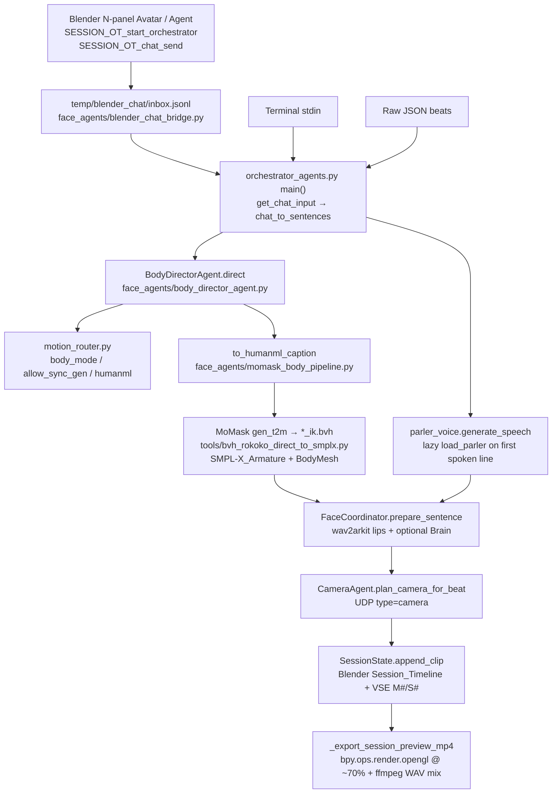
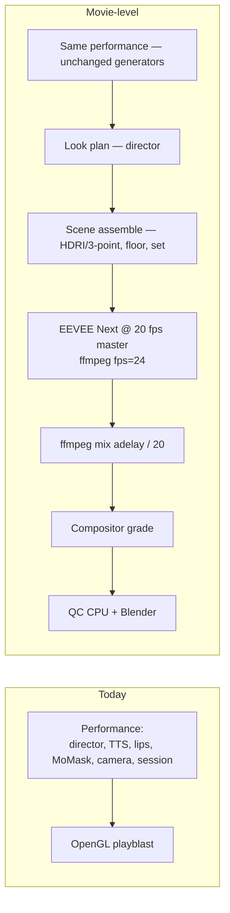
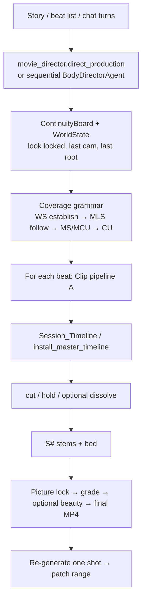

# Movie-Level Clips and Full Films from Our Performance Pipeline

How we take **this** pipeline (director → MoMask → SMPL-X → Parler/lips → CameraAgent → session) to clips and short films people pick over text-to-video.

**Read this way**

1. Thesis + Key Decisions — why we do not send the prompt to Sora/Kling.
2. **Section A** — every step of **one take** (prompt → edit → Export movie).
3. **Section B** — every step of a **full movie** (story → assembly → one-shot regen).
4. **Section C** — when a clip is allowed to be called movie-level.
5. **PR Plan + Appendix runbook** — what to build, in order, and how to run it.

| Field | Value |
|---|---|
| **Title** | Movie-Level Production on the Existing Avatar Pipeline |
| **Date** | 2026-08-19 |
| **Status** | Complete (implementation spec) |
| **Path** | `docs/MOVIE_LEVEL_PRODUCTION.md` |

---

## Product thesis (non-negotiable)

Text-to-video (Sora, Kling, Veo, Runway) already wins **"pretty 8 seconds from a sentence."** Users will choose this product only if **both** are true:

1. **The watched clip is as cinematic as T2V** — pixels (lighting, set, grade, motion blur, DoF) **and** sound (speech stems, mix, optional bed).
2. **The performance underneath is ours** — same avatar identity, real speech + lips, real body motion, camera coverage, speech-safe delete/inpaint, and the **same person continuing across takes**.

**We do not replace MoMask / SMPL-X / Blender / director with a T2V model as the motion or story source.** v1 “beauty” is **Blender compositor grade** on OUR EEVEE plate (`LookPlan.grade`). Neural restyle is **out of v1 DoD** (look-only constraint if ever added; never the generator of motion, lips, or cuts).

If a clip cannot prove (2), it is not a product export even if it looks pretty.

---

## Overview

Today the interactive path (`blender_receiver.py` N-panel **Start** → `orchestrator_agents.py`) can generate, append, edit, and OpenGL-playblast a session: director beats, Parler speech, wav2arkit lips, MoMask + Rokoko-style SMPL-X body, CameraAgent coverage, VSE M#/S# strips, speech-safe delete/inpaint. That path already owns **performance**. It does **not** own **look**: no HDRI, no lighting agent, no set dressing, no EEVEE/Cycles product render.

A second, offline path (`face_agents/movie_production/` + `run_movie_pipeline.py`) already plans multi-shot films (`ShotDetail`, `ContinuityBoard`, `install_master_timeline`) but also stops at Workbench/OpenGL preview and currently **refuses motion-only shots** (`baker.py` requires spoken dialogue).

This design takes **the current generation path** (Blender addon + orchestrator — not the web viewer) and adds a director-owned **Look plan**, a **scene assemble** step, an **EEVEE-first movie render** (optional Cycles) evaluated at **native 20 fps then ffmpeg-conformed to 24**, mix on the same 20 fps speech clock, compositor grade, split QC, Preview vs Export Movie buttons, and a **many-take assembly** that reuses the same clip pipeline. Chat sessions and offline movie packages join the **same** `Session_Timeline`, including **body Actions**, without requiring `--play`.

---

## Background & Motivation

### Current interactive loop (the generation path)

Verified in code. Do not invent a second generator.



**Entry.** `SESSION_OT_start_orchestrator` (`blender_receiver.py` ~5555) launches `orchestrator_agents.py` with `LLM_CHAT=1`, `USE_MOMASK=1`, `MOMASK_SYNC=1`, `USE_MOVIE_CAMERA=1`. Chat goes through `temp/blender_chat/inbox.jsonl`. `SESSION_OT_chat_send` is the Send button.

**Director.** `BodyDirectorAgent.direct` accepts natural language, stage+line, or raw JSON. LLM path `_direct_llm` then `_ensure_humanml` (always rewrite via `to_humanml_caption` — **never raw chat to gen_t2m**). Rule path `_direct_rules`. `orchestrator_agents._normalize_director_items` / `parse_beat` produce the beat dict.

**Speech vs motion-only.** `tts_to_wav` skips Parler for empty / HumanML captions (`_is_humanml_caption`) and writes silence. Dialogue path: **TTS ∥ MoMask**, then face bake (`process_sentence`). Motion-only: skip face bake / Parler. Live speech-delay fallback in `process_sentence` / `coordinator.play_sentence` is `(1 + 6) / 20.0` = **0.35 s (7 frames @ 20 fps)** when `momask_meta["speech_delay_s"]` is missing. `momask_body_pipeline.speech_delay_s()` is 8/20 = 0.40 s and is written on cache meta when generate succeeds — **product mix uses the persisted `SessionClip.speech_frame_start` on the 20 fps master**, not a third clock.

**Body.** `_maybe_run_momask_body` → `should_use_momask` → `build_humanml_prompt` → cache or `generate_body_action` (official `gen_t2m` `*_ik.bvh`) → `retarget_bvh_to_smplx_action` → helper Rokoko bake on `SMPL-X_Armature` + `BodyMesh`. Heading: `align_heading_and_floor` **FACE** (left_hip − right_hip × +Z → −Y), not travel-to-−Y. Floor: `apply_mesh_sole_clearance` always (skin on plane, not joints). Joint `floor_plant_action` is opt-in (`MOMASK_FLOOR_PLANT`). Palm skin via `apply_hand_floor_orient` before sole lift.

**Camera.** `CameraAgent` / `plan_camera_for_beat`. Full-body → WS/MLS **follow**. Roles `MovieCam_A/B/C/Env`. Anchors `head` / `chest` / `full_body`. Duration = `max(speech, body_play)` via `ctx.extras["camera_duration_s"]`. `USE_MOVIE_CAMERA` defaults **on**.

**Session.** Append-only `Session_Timeline` (`session_state.py` + `blender_receiver.py`). VSE blue M# motion + orange S# speech. Speech-safe `_snap_range_speech_safe`. Operators: inpaint, delete range, delete last, trim, split-safe.

**Export today.** `_export_session_preview_mp4` (~6067): OpenGL playblast, resolution forced ≤70% if >80%, ffmpeg `adelay` mix of clip WAVs. **No EEVEE, no Cycles, no HDRI, no lighting agent, no set dressing.** One button: `SESSION_OT_export_preview` ("Export preview MP4").

### Current offline movie path (not the chat loop)

`run_movie_pipeline.py` → `MovieProductionPipeline` (`face_agents/movie_production/pipeline.py`):

- Plan: `movie_director.direct_production` / `plan_rules` / `plan_llm` + `_merge_for_cinematic`
- Continuity: `ContinuityBoard`, `WorldState` (`location`, `time_of_day` already exist but are **not applied as lights/sets**)
- Bake: `baker.bake_shot` — TTS, pad holds, face∥body, camera over full take, face timeline JSON
- Join: `install_master_timeline` today sends **only** `type=face_keyframes` + `type=camera` (first shot `clear_previous=True`). It does **not** load cached `*.blend` Actions, send `type=body`, or call `_append_session_master`. `--join-timeline` without `--play` therefore leaves T-pose / last pose on Export movie. `play_package` live-plays body via `coord.play_sentence` **after** join.
- Preview: `tools/blender_movie_preview.py` is **Workbench**, not EEVEE. Engine IDs for stills in `tools/blender_body_motion.py` `render_preview` try **`BLENDER_EEVEE_NEXT` then `BLENDER_EEVEE`**.
- Gap: `bake_shot` **fails** on empty spoken (`"empty spoken dialogue"`) — motion-only movie takes are blocked. `_tts` always `load_parler()`.
- Gap: `WorldState.location` / `time_of_day` never drive a look pass. Defaults are `"default"` / `"day"` (map `"default"` → studio recipe).
- Clocks today: MoMask Actions **20 fps**; `SessionState.fps` and `MovieProductionPipeline.fps` **30.0**; live UDP play samples source Action with wall-clock × `clip_fps` and **forces `loop=False` for momask**; `_append_session_master` **copies Action frames 1:1** onto `Session_Timeline` (NLA strip scale 1.0, **muted**); Preview/export bind `Session_Timeline` and evaluate **scene frames 1:1** (there is **no** `u = t * clip_fps` on this path). Mix uses `delay = (speech_frame_start-1) / sc.render.fps` (scene fps, often 24) while `speech_frame_start` was computed at `clip_fps=20` — already a preview sync hazard.

### Pain points vs T2V

| What the user sees today | Why they still pick Sora/Kling |
|---|---|
| Correct same avatar, real lips, real body | Viewport/OpenGL gray character on empty floor |
| Speech-safe edit, continue root | No night/day, no set, no grade, no 1080p cinematic plate |
| CameraAgent coverage | Product MP4 is a playblast |
| Offline movie planner exists | Not wired into the chat loop; no re-render of one shot into a locked picture |

---

## Goals & Non-Goals

### Goals

1. One **clip (take)** from prompt → watchable **movie-level MP4** using **our** performance stack, with look + EEVEE (optional Cycles) as the product picture.
2. Many takes → **short film** on one master timeline, coverage grammar, continuity, transitions we own, mix, picture lock, per-shot regen.
3. Keep **Preview** (OpenGL) for iteration; add **Export movie** that never uses OpenGL as the product.
4. Feature-flag look/EEVEE so generate / delete / inpaint do not break. Neural beauty is not in v1.
5. QC gates (CPU vs Blender) that **refuse** Export movie if identity, lips (timeline+WAV), floor, heading, or mid-speech cuts fail.

### Non-goals

- Replacing MoMask, SMPL-X, Blender, or the director with a T2V model.
- Replacing the Blender addon generation path with the web viewer.
- Locking camera to `A_cam` / static.
- Sending look/location/grade text to `gen_t2m`.
- Crawl/walk keyword lists as the motion policy (engines stay capability-based via `motion_router.py`).
- Global skeleton drop / joint-on-plane plant as the floor solution.
- Using raw user chat as the MoMask caption.
- Generating new characters per shot (identity lock is the product).
- Multi-hero dialogue coverage in v1 (single `hero` in `WorldState.ensure_character("hero")`). Second character is a later film.

---

## Key Decisions

| # | Decision | Rationale |
|---|---|---|
| K1 | **Performance stack stays**: Director → HumanML → MoMask `*_ik.bvh` → Rokoko helper bake → SMPL-X + BodyMesh; Parler + wav2arkit; CameraAgent. T2V is never the motion/story source. | Product thesis. Identity + lips + body + cuts are the moat. |
| K2 | **Look is director-owned and never sent to MoMask.** New `LookPlan` on `DirectorBeat` / `ShotDetail` / `SessionClip`. | Prevents caption pollution (`"a person walks in a neon alley at golden hour"` breaking t2m). |
| K3 | **Helper Rokoko bake is source of truth for body** (`tools/bvh_rokoko_direct_to_smplx.py`). No KeeMap/Mixamo on the product path. | Already the working retarget; movie look sits **on** that Action, not a restyle of BVH. |
| K4 | **Heading = FACE** (hips × up → camera −Y). Travel-to-−Y is fallback only when face cannot be measured. | 180° bug was travel/hips. |
| K5 | **Skin on plane, not joints.** `apply_mesh_sole_clearance` always; `floor_plant_action` remains opt-in. No global skeleton drop. | Joints live inside the mesh; planting them puts soles through the floor. |
| K6 | **CameraAgent picks angles.** Coverage grammar is a **planner policy** (establish → action → dialogue → punch-in), not a lock to A_cam/static. | Users lose to T2V if every take is MS static. |
| K7 | **Preview vs Movie are two buttons.** Preview = current OpenGL. Movie = EEVEE first (`BLENDER_EEVEE_NEXT` then `BLENDER_EEVEE`), optional Cycles. Evaluate/render the **20 fps master**, then ffmpeg-conform picture to 24. Motion blur + DoF from the active MovieCam. | Iteration speed vs product pixels. OpenGL is never the product. |
| K8 | **Chat session and offline movie join the same master, including body.** Canonical live master = `Session_Timeline`. Join uses the same `_append_session_master` path as chat (`type=session_append` or body packet with `append_timeline`, **no live play**). `install_master_timeline` today is face+camera UDP only — that is a gap this design closes. `--join-timeline` without `--play` must be enough for Export movie. | One character, one timeline, re-generate one shot. T-pose export is a product failure. |
| K9 | **v1 look finish is compositor grade** (`LookPlan.grade`) on the EEVEE plate. Neural beauty is **out of v1 DoD** (`USE_BEAUTY_PASS` stays 0; no embedding/RMS identity math in v1). If neural is ever added, it is look-only on our plate with fallback to the 3D render. | Grade closes the “gray viewport” gap without a backend we do not have. |
| K10 | **Speech-safe edits remain whole-line.** v1 dirty picture → **re-render the full session plate** (not mid-GOP H264 splice). Inpaint is **two-step: delete overlapping take(s), then new body-only clip** (matches live `process_sentence`). Preview can stay stale until the next playblast. | Mid-word cuts look cheaper than T2V; mid-GOP replace glitches. |
| K11 | **Do not set `MOMASK_ALL=1` as the product Start default.** Director/router decide engines. Addon Start currently forces `MOMASK_ALL=1` — that is a rollout bug to fix, not a movie feature. | Known slam-catalog / greetings-into-t2m failure. |
| K12 | **One master clock: 20 fps.** Evaluate and render `Session_Timeline` at **native 20 fps** (`scene.render.fps = 20`). ffmpeg-conform the silent plate to 24 (`-filter:v fps=24`, duration preserved, **no Action stretch, no NLA scale, no `u = t * clip_fps` on the master**). Mix `adelay` uses `(speech_frame_start - 1) / 20.0` — the same clock as `speech_frame_start`, camera `frame_abs`, face timeline, and VSE. **Do not** set `scene.render.fps = 24` with NLA scale 1.0 on 1:1-copied 20 fps keys (that plays motion ~20% fast). Double-cycle was a **live UDP speed/loop** bug (`_apply_body_play` `loop=False` for momask); it is not solved by resampling baked keys onto 24. | `_append_session_master` copies keys 1:1; OpenGL/EEVEE evaluate those frames 1:1. Keep that. Conform is picture-only. |
| K13 | **Body fill policy is first-class.** MoMask **never** loops. Catalog walk/idle **may** loop at native rate. `stretch` is **forbidden**. Long locomotion uses `momask_match` (generate `motion_length` to take, cap 196 frames) or split takes. Align chat extras, baker `_clip_loop_flag`, and `_apply_body_play`. | Schema already has `CLIP_POLICIES`; chat and movie disagree today (`ShotDetail.clip_policy` defaults `"loop"`; chat forces `"loop": False` for MoMask). |

### Clocks (locked — do not invent a fourth)

| Clock | Rate | Lives here | Does not live here |
|---|---|---|---|
| **Master evaluate / render** | **20 fps** | `Session_Timeline` keys, VSE M#/S#, `speech_frame_start/end`, camera `frame_abs`, face timeline `frame`, OpenGL Preview, EEVEE plate, `adelay` divisor | Picture file after conform |
| **Live UDP play** | wall-clock × packet `clip_fps` (20 for MoMask) | `_apply_body_play` only; momask `loop=False` | Session_Timeline scrub/export |
| **Delivered picture** | **24 fps** | ffmpeg `fps=24` after the 20 fps plate exists | Action FCurves, NLA scale |
| **Catalog Action authoring** | often ~30 | resampled **onto 20 fps at append** so 1:1 master eval stays correct (`dest_span = round(src_span * 20 / clip_fps)`) | A second scene fps |

`MovieProductionPipeline.fps` and `SessionState.fps` **become 20.0** for the master (today they are 30.0). `master_timeline.json` keeps per-clip `clip_fps` (20 for momask) plus `master_fps: 20` and `picture_fps: 24`.

**Shared formula:** `t_seconds = (frame - 1) / 20.0` for speech, camera, face, mix, QC-AUD.

---

## Current vs target architecture



---

## Proposed Design

### New types (shared by chat clip and movie)

Add `LookPlan` in a **new** module `face_agents/look_schema.py` (keep `director_schema.py` from growing another catalog). **On-wire shape is nested `look: {…}`** on `DirectorBeat`, `ShotDetail`, `SessionClip`, UDP, extras. `parse_beat` **also** accepts flat `look_location` / `look_time_of_day` / … for one release, then always stores nested.

```python
# face_agents/look_schema.py
from dataclasses import dataclass, asdict, fields
from typing import Any, Dict, Optional

LOOK_LOCATIONS = frozenset({
    "studio", "interior_room", "corridor", "street", "park", "stage", "default",
})
LOOK_TIMES = frozenset({
    "dawn", "day", "golden_hour", "dusk", "night", "overcast",
})
LOOK_MOODS = frozenset({
    "neutral", "soft", "hard", "warm", "cool", "noir", "high_key", "practical",
})
LOOK_GRADES = frozenset({
    "none", "neutral", "warm", "cool", "film_contrast", "bleach",
})
LOOK_SETS = frozenset({
    "empty_floor", "studio_cyc", "interior_simple", "exterior_ground",
})
# User / WorldState aliases → enum
LOOK_LOCATION_ALIAS = {"default": "studio", "": "studio"}
LOOK_TIME_ALIAS = {"sunset": "golden_hour", "sunrise": "dawn"}

@dataclass
class LookPlan:
    location: str = "studio"
    time_of_day: str = "day"
    light_mood: str = "soft"
    grade: str = "neutral"
    set_preset: str = "studio_cyc"
    hdri_name: str = ""          # empty ⇒ resolve in scene_presets; never a MoMask string
    wardrobe_id: str = "hero_default"  # v1: no-op if no wardrobe objects in the .blend
    locked: bool = True
    notes: str = ""

    def to_dict(self) -> Dict[str, Any]:
        return asdict(self)

    @classmethod
    def from_dict(cls, d: Optional[Dict[str, Any]] = None, **flat: Any) -> "LookPlan":
        raw = dict(d or {})
        # flat look_* from LLM / JSON paste
        for f in fields(cls):
            k = f"look_{f.name}"
            if k in flat and f.name not in raw:
                raw[f.name] = flat[k]
        loc = LOOK_LOCATION_ALIAS.get(str(raw.get("location") or "studio"), str(raw.get("location") or "studio"))
        tod = LOOK_TIME_ALIAS.get(str(raw.get("time_of_day") or "day"), str(raw.get("time_of_day") or "day"))
        if loc not in LOOK_LOCATIONS:
            loc = "studio"
        if tod not in LOOK_TIMES:
            tod = "day"
        return cls(
            location=loc,
            time_of_day=tod,
            light_mood=str(raw.get("light_mood") or "soft"),
            grade=str(raw.get("grade") or "neutral"),
            set_preset=str(raw.get("set_preset") or "studio_cyc"),
            hdri_name=str(raw.get("hdri_name") or ""),
            wardrobe_id=str(raw.get("wardrobe_id") or "hero_default"),
            locked=bool(raw.get("locked", True)),
            notes=str(raw.get("notes") or ""),
        )
```

`DirectorBeat.look: LookPlan` (default `LookPlan()`). `to_dict()` emits `"look": self.look.to_dict()`. `parse_beat`: `look = LookPlan.from_dict(raw.get("look") if isinstance(raw.get("look"), dict) else None, **raw)`. `_normalize_director_items` **must copy `"look"`** (today it copies camera fields and **drops unknown keys**). Unit test: JSON beat with nested `look` **and** flat `look_location` → extras → UDP; `humanml_prompt` unchanged.

`WorldState.location == "default"` and `ShotDetail.location == "default"` map to studio via `LOOK_LOCATION_ALIAS`.

**Never** concatenate look fields into `humanml_prompt`.

### New Blender UDP packet

```python
{
  "type": "look",
  "op": "apply",           # apply | clear
  "session_id": "...",
  "look": {
    "location": "studio",
    "time_of_day": "golden_hour",
    "light_mood": "warm",
    "grade": "warm",
    "set_preset": "studio_cyc",
    "hdri_name": "studio_soft_01",  # "" ⇒ recipe resolve
    "wardrobe_id": "hero_default",
    "locked": True,
  },
}
```

Handled in `blender_receiver.py` next to camera packets (`_ensure_movie_camera`). Look objects live in collection `Look_Set` so they can be cleared without touching `SMPL-X_Armature` / `BodyMesh` / `MovieCam_*`. Ground object name is always `Look_Ground` (z=0). **No `type=render` UDP** (expensive; Export movie is a Blender operator only).

### Feature flags

| Flag | Default | Meaning |
|---|---|---|
| `USE_MOVIE_CAMERA` | `1` (exists, `camera_agent.movie_camera_enabled`) | CameraAgent UDP |
| `USE_MOVIE_LOOK` | `0` then `1` after PR2 | Apply LookPlan in Blender |
| `USE_EEVEE_EXPORT` | `0` then `1` after PR5 | Movie button uses EEVEE Next |
| `USE_CYCLES_EXPORT` | `0` | Optional path from Movie button |
| `USE_BEAUTY_PASS` | **always `0` in v1** | Neural restyle **not shipped**; compositor grade is not this flag |
| `USE_MOMASK` | `1` | Unchanged |
| `MOMASK_ALL` | **must stay `0` in product Start** | Do not slam catalog |
| `MOMASK_SYNC` | **Start keeps `1`** | **Honest:** `momask_sync_generate` returns True whenever `MOMASK_SYNC=1`, even if `allow_sync_gen=False`. Open gen **always waits** on cache miss. Router `allow_sync_gen` only matters if SYNC is unset/0. |
| `USE_FACE_TIMELINE` | **`1` required for movie join** | If off, B5 face keys never land |
| `USE_BRAIN` | Start **0**; `run_movie_pipeline` **`--no-brain` default** | Avoid VRAM clash with MoMask+Parler+EEVEE |

**Start surface (A16 / E):** `SESSION_OT_start_orchestrator` today **overwrites** env. After PR1 it still hard-codes routing flags, but **reads scene props** (or `temp/movie_flags.env`) for look/EEVEE so enabling them does not require another operator edit:

| Scene prop | Maps to |
|---|---|
| `scene.session_use_movie_look` | `USE_MOVIE_LOOK` |
| `scene.session_use_eevee_export` | `USE_EEVEE_EXPORT` |
| `scene.session_look_lock` | LookPlan.locked default |

Draw **Export movie** only if `USE_EEVEE_EXPORT` is on (`poll` / `layout.enabled`). Preview always visible.

---

## A. Clip (one take) — generate → edit → export

Every step from user prompt to a watchable MP4. **Owners** are agents/files. **Pass/fail** is what a reviewer or QC job checks before the clip may be called movie-level.

### A0. Preconditions (every take)

| Check | Pass | Fail |
|---|---|---|
| Blender `blender_receiver.py` stream running | UDP 9001 accepting | Packets dropped |
| Orchestrator running | `SESSION_OT_start_orchestrator` or `python orchestrator_agents.py` | No generation |
| Character | `SMPL-X_Armature` + `BodyMesh` in scene | Abort body |
| Feature flags | `USE_MOVIE_CAMERA=1`; look/EEVEE via scene props after PR1 | Preview still works if look flags off. **Restart Start** after PR1. |

---

### A1. Intake (chat / story / JSON)

| | |
|---|---|
| **Owner** | UI: `SESSION_OT_chat_send`, `SESSION_PT_chat` (`blender_receiver.py` ~5717, ~6312). Bridge: `face_agents/blender_chat_bridge.py`. Loop: `orchestrator_agents.get_chat_input`, `chat_to_sentences`. |
| **Inputs** | Natural language; stage+dialogue; raw JSON `{beats:[...]}` / `{sentences:[...]}`; edit commands `delete`, `inpaint`, `reset`. |
| **Outputs** | One or more raw beat dicts **or** an edit opcode (handled in A15). |
| **Does not** | Call MoMask, Parler, or T2V. |

**Steps**

1. User types in N-panel Prompt or terminal.
2. `_chat_push_inbox` writes `temp/blender_chat/inbox.jsonl`.
3. `get_chat_input` pops the line.
4. If line is `reset` / `new scene` → `SessionState.reset` + UDP `session_reset` (A15).
5. If `delete …` / `inpaint …` → A15, do not generate a new performance unless inpaint queues a body-only beat.
6. Else `chat_to_sentences` → `BodyDirectorAgent.direct`.

**Pass/fail**

- Pass: non-empty beat list **or** recognized edit/reset.
- Fail: empty input → `_fallback_beat("...", "neutral", 0.5)` only as last resort; log it.
- Fail: JSON parse error falls through to NL director, never to `gen_t2m`.

---

### A2. Director performance plan

| | |
|---|---|
| **Owner** | `BodyDirectorAgent` (`face_agents/body_director_agent.py`). Schema: `DirectorBeat` / `parse_beat` (`face_agents/director_schema.py`). Router: `face_agents/motion_router.py`. HumanML: `to_humanml_caption` (`momask_body_pipeline.py`). Movie twin: `movie_director._to_shot_detail` + `_apply_motion_router`. |
| **Inputs** | User text, `previous_state` (`_prev_state` / `SessionState.base_state`), optional `scene_note`. |
| **Outputs** | Beat(s) with: `text` (spoken only), `stage` (if split), `emotion`, `intensity`, `state`, `actions`, `body_mode`, `humanml_prompt`, `motion_duration_s` / `motion_length`, `allow_sync_gen`, `motion_only`, `camera_shot/move/role` (optional hint — CameraAgent may override). |

**Steps**

1. `_extract_stage_and_line` splits physical vs spoken.
2. LLM (`DIRECTOR_SYSTEM_PROMPT`) or `_direct_rules`.
3. `_ensure_humanml`: if `body_mode` in `{momask, both}` or `motion_only` or `is_motion_caption`, rewrite with `to_humanml_caption`. Catalog/procedural skips rewrite.
4. `parse_beat` normalizes emotion, state (`normalize_state` — unknown → `locomotion`, **not** slam to standing talk), actions from catalog (gestures only).
5. `MotionRouter` sets `body_mode`, `allow_sync_gen`, `motion_reason`. **No crawl/walk verb whitelist** — capability match vs `body_motion/catalog.json`.
6. `allow_sync_gen=True` only when router chose open vocab (or movie director set it). `momask_sync_generate` honors this + `MOMASK_SYNC`.

**HumanML rules (do not regress)**

- Third person, `"a person …"`.
- Concrete body verbs. 8–30 words typical.
- **No dialogue** in `humanml_prompt`. Speech only in `text` / `spoken`.
- Bare `hi`/`walk` expanded by `_clean_caption` — still director-owned, never raw chat.

**Pass/fail**

| Gate | Pass | Fail |
|---|---|---|
| Spoken vs stage | Dialogue has no walk/wave instructions | `"walk forward"` in `text` sent to Parler |
| HumanML | `body_mode=momask` ⇒ caption matches `_HUMANML_LEAD` | Raw `"do a backflip"` to gen_t2m |
| Engine | Greeting `hi` stays catalog (`_maybe_run_momask_body` skip list + director) | `MOMASK_ALL=1` slamming `hi` into t2m |
| Duration | Jump/walk have `motion_length` 64–196 or prompt floor | 1.5s stub because TTS was short |

---

### A3. Look plan (NEW) — director-owned, never sent to MoMask

| | |
|---|---|
| **Owner** | New `LookAgent` in `face_agents/look_agent.py`. Nested `DirectorBeat.look: LookPlan` (`parse_beat` accepts nested **or** flat `look_*` for one release). Movie: `ShotDetail.look` + `ContinuityBoard` (board `location` `"default"` → studio). Apply later in A10. |
| **Inputs** | User hint (“night street”, “warm interior”), previous session look if `locked`, `WorldState.location` / `time_of_day`. |
| **Outputs** | Nested `look` on the beat, `ctx.extras["look"]` (`LookPlan.to_dict()`), UDP `type=look`. **Not** appended to `humanml_prompt`. |

**Steps**

1. If user/JSON specified `look` or `look_*`, `LookPlan.from_dict` (aliases: `sunset`→`golden_hour`, `default`→`studio`).
2. Else infer: keywords `night`/`sunset`/`studio` → time/location; default `studio` + `day` + `soft` + `studio_cyc` so first clip is already cinematic vs empty void.
3. If `SessionState` / `ContinuityBoard` has a locked look, **reuse it**. Only change location when `look.locked=False` or user says `new scene` / `new set`.
4. Resolve `hdri_name` if empty from `face_agents/scene_presets.py`.
5. Orchestrator copies **nested** `look` onto extras **after** MoMask. `_normalize_director_items` copies `"look"`.

**Extend `DirectorBeat`** with `look: LookPlan = field(default_factory=LookPlan)` — not a parallel set of flat fields on the dataclass. `to_dict` emits nested `look`.

**Pass/fail**

- Pass: look present; `humanml_prompt` contains **zero** location/time/grade tokens from the look enums unless they were already in the physical stage (“walks outdoors” is motion, “golden hour” is look).
- Fail: `"a person walks in a neon alley, cinematic lighting"` as t2m prompt.
- Fail: look changes mid-sentence without a new scene command.

---

### A4. Speech (Parler, silence for motion-only)

| | |
|---|---|
| **Owner** | `orchestrator_agents.tts_to_wav`; `parler_voice.load_parler` / `generate_speech` / `build_voice_style`. Movie: `baker._tts`. |
| **Inputs** | Clean spoken `text` (tokens stripped). Emotion + intensity → Thomas-locked style. |
| **Outputs** | WAV path `temp/agents_sentence_{idx}.wav`, `duration`, `sr`. Motion-only: **silence WAV of take length** (`target_duration_s` / `motion_duration_s`, not the chat 3.5 s stub). |

**Steps**

1. `orchestrator_agents.main()` must **not** call `load_parler()` at startup (already: load on first spoken line).
2. Motion-only / HumanML caption → `_write_silence_wav`; **do not** load Parler.
3. Dialogue: `generate_speech` (lazy `load_parler` inside). Same `SPEAKER_PREFIX` every line.
4. Chat: TTS ∥ MoMask then face bake. Baker v1 (PR1): motion-only silence path; TTS∥body parity can follow once silence does not call `_tts`.
5. Token segments (`[laugh]`) never go to Parler (`play_token_reaction`).

**Pass/fail**

- Pass: one Parler process/model; second spoken line reuses `_model`.
- Fail: double-load (startup + first line) — VRAM death with MoMask+Brain.
- Fail: motion caption spoken as dialogue.
- Fail: identity voice change between takes (style prefix drift).
- Fail: baker motion-only still calling `_tts` / `load_parler()`.

**Movie baker fix (PR1, complete):** `bake_shot` currently `if not speak: bake_errors.append("empty spoken dialogue"); return`. Replace with:

1. If not `speak`: write silence WAV of `max(target_duration_s, motion_duration_s, 0.5)` seconds via a helper that **does not** import/call `load_parler` or `_tts`.
2. Set `shot.audio_path` to that file (keeps `validate.py` happy: `bake_ok and not audio_path` is an error).
3. Skip `prepare_sentence` / face bake (`is_speaking=False` context only if a ctx is still required).
4. Skip `_tts` entirely — today’s `_tts` **always** `load_parler()` first (`baker.py`).
5. `run_movie_pipeline.py` default **`--no-brain`** to match Start `USE_BRAIN=0`.

---

### A5. Body (MoMask + retarget + floor/heading)

| | |
|---|---|
| **Owner** | `orchestrator_agents._maybe_run_momask_body`; `momask_body_pipeline.generate_body_action`, `retarget_bvh_to_smplx_action`; `tools/bvh_rokoko_direct_to_smplx.py`. Catalog fallback: `face_agents/body_agent.py` / motion_plan clip_id. |
| **Inputs** | `humanml_prompt` (official), `duration_s` / `motion_length`, `allow_sync_gen`, seed. |
| **Outputs** | Action name on library blend, `action_frames` @ 20 fps, `speech_delay_s` (persist from meta; live fallback **0.35 s / 7 frames** if missing), `body_play_s`, `clip_policy`. |

**Steps (product path — do not skip)**

1. `should_use_momask` — catalog/procedural **return False even if `MOMASK_ALL=1`** (already in `should_use_momask`; keep this).
2. Greeting skip in `_maybe_run_momask_body` (`hi`/`hello`/…).
3. Cache `lookup_cached_action` / `find_cache_by_prompt` — same caption reuses Action (identity of **motion**, not a new body).
4. Else if `momask_sync_generate(allow_sync_gen)`: `generate_official_bvh` (`third_party/momask-codes` `gen_t2m.py`) → official `*_ik.bvh` only.
5. `retarget_bvh_to_smplx_action`: Blender background, host `body_motion/retarget_host.blend`, map `our modified bhv mapping to smplx.json`, script `tools/bvh_rokoko_direct_to_smplx.py`.
6. Helper bones `_RSL_H`, COPY_ROTATION, pelvis COPY_LOCATION, **bake Action** — this bake is source of truth.
7. `align_heading_and_floor`: FACE method (`_face_fwd`: left_hip − right_hip × +Z → SMPL-X −Y). Travel method only if face vector missing **and** travel ≥ 0.18 m.
8. `apply_hand_floor_orient` (palm skin) **before** sole lift.
9. `apply_mesh_sole_clearance` **always** — lift pelvis so contact **mesh** z ≥ 0; never plant joints; never global drop. Cap per-frame lift 0.08 m.
10. `ensure_action_in_blender_via_packet_hint` so live receiver can append the Action.

**Remaining quality gates (movie-prerequisite; already in retarget, must stay on)**

| Gate | Where | Pass |
|---|---|---|
| Official IK BVH | `generate_official_bvh` | File `*_ik.bvh`, not raw joints-only |
| Helper bake complete | `bvh_rokoko_direct_to_smplx.py` ~1670 | Baked keys ≥ 80% of expected span |
| Heading FACE | `align_heading_and_floor` | `method=="face"`; yaw logged; character faces −Y |
| Mesh sole | `apply_mesh_sole_clearance` | `min_skin ≥ -0.002` on plane z=0 |
| No global drop | `floor_plant_action` not default | `MOMASK_FLOOR_PLANT` stays 0 unless research |
| Action cap | `HARD_MAX_BODY_FRAMES=196`; session span cap 214 | No 3000-frame duration*fps bug (`append_clip` comment) |

**Pass/fail (clip QC later re-checks in Blender)**

- Fail: travel-only heading on a walk that already faced opposite path (180°).
- Fail: soles through floor (`min_skin < -0.01`).
- Fail: KeeMap/Mixamo on product path.

---

### A5b. Body fill policy (NEW — take duration vs Action length)

| | |
|---|---|
| **Owner** | `ShotDetail.clip_policy` / baker `_clip_loop_flag`; chat `ctx.extras["motion_plan"]["loop"]`; `_apply_body_play` (forces momask `loop=False` today). |
| **Inputs** | Engine (momask vs catalog), take duration, `action_frames`, `HARD_MAX_BODY_FRAMES=196`. |
| **Outputs** | `clip_policy` + `loop` flag that **agree** across chat, baker, and receiver. |

Live conflict: `CLIP_POLICIES` includes `loop` and `ShotDetail.clip_policy` **defaults to `"loop"`**; chat `process_sentence` sets `"loop": False` for MoMask; `_apply_body_play` **hard-off loop** for momask so walks do not double-cycle. B6 “hold_end freeze” would freeze a 4 s walk mid-stride on a 10 s take.

**Product table (also in Appendix)**

| Body | Take vs Action | Policy |
|---|---|---|
| MoMask locomotion / open | take ≤ Action | `momask_match` or `hold_end` — **never loop** |
| MoMask | take > HARD_MAX (196 frames ≈ 9.8 s @ 20 fps) | **split takes** or a second generate; **do not** loop |
| Catalog walk / idle | any | `loop=True` at native `clip_fps` (resampled onto 20 fps master at append) |
| Catalog gesture / talk | dialogue | `hold_end` |
| `stretch` | — | **forbidden** on the product path |

**Align**

- Chat extras: momask → `loop=False`, `clip_policy="momask_match"` (or `hold_end` if director asked a hold). Catalog walk/idle → `loop=True`. Catalog gesture → `hold_end`.
- Baker `_clip_loop_flag`: return False for momask / `momask_match` / `hold_end` / `stretch`; True only for catalog walk/idle `loop`.
- Default `ShotDetail.clip_policy` **changes from `"loop"` to `"hold_end"`** (safe); director/router set `momask_match` or catalog `loop` explicitly.
- Receiver: keep momask loop hard-off as a safety net.

**Pass/fail:** a 10 s walk is one-shot or two takes, never two cycles in one Action; a 6 s `talk_open` on 4 s speech holds the last pose, does not stretch.

---

### A6. Face / lips bake (skip only when truly motion-only)

| | |
|---|---|
| **Owner** | `FaceCoordinator.prepare_sentence` (`face_agents/coordinator.py`); `wav2arkit`; optional `brain_inference`; lips/eyes/brows/cheeks/head agents. |
| **Inputs** | WAV + duration + emotion. Motion-only: `FaceContext(is_speaking=False)` empty envelope. |
| **Outputs** | Face UDP stream and/or face timeline JSON (`USE_FACE_TIMELINE`). |

**Steps**

1. If `motion_only` or `_is_humanml_caption`: skip `prepare_sentence` (orchestrator already does this).
2. Else after WAV exists: wav2arkit mouth/jaw; Brain A2E if `USE_BRAIN=1` (addon Start currently sets `USE_BRAIN=0` — movie export should allow opt-in Brain without requiring it for lips).
3. Face never reads `humanml_prompt` to drive mouth.
4. Bake face timeline keyed to session frames so scrub matches live.

**QC-LIP v1 (implementable, no viseme-vs-RMS channel yet):** dialogue clip has a face timeline JSON **and** WAV duration matches the timeline span ±50 ms. Peak-lag vs RMS is **deferred** until a mouth-open FCurve is logged. Do not block Export movie on embedding math.

**Pass/fail**

- Pass: QC-LIP v1; lips move on dialogue; silence on motion-only.
- Fail: talking on silence; frozen mouth on speech.
- Fail: Brain-only upper face without lips on dialogue.

---

### A7. Camera (CameraAgent; coverage A/B/env; duration = max(speech, body))

| | |
|---|---|
| **Owner** | `face_agents/camera_agent.py` `plan_camera_for_beat`, `select_shot_and_move`, `CameraAgent`. Send: `FaceCoordinator._send_camera_plan`. Receive: `blender_receiver.py` camera packets / `_ensure_movie_camera`. |
| **Inputs** | `duration_s=max(speech, body_play)`, emotion, state, actions, humanml_prompt, `session_clip_index`, last shot/role, optional director hint. |
| **Outputs** | `CameraPlan` keyframes, role → `MovieCam_A/B/C/Env`, `subject_anchor` head/chest/full_body, UDP `type=camera`. |

**Steps**

1. Orchestrator sets `camera_duration_s = max(duration, body_play_s)` then `_attach_and_save_movie_plan`.
2. `select_shot_and_move`: full-body / HumanML → **WS/MLS follow** (not hip-lock MS). Dialogue → MS/MCU. High intensity → CU. **Do not lock A_cam/static.**
3. `build_keyframes` subject-relative offsets; Blender adds live anchor each frame (`follow` for locomotion).
4. Soft head track **off** for ECU/CU (inside-mesh bug already documented in baker/coordinator).
5. `set_scene_camera=True` so playblast/EEVEE use the MovieCam, not viewport user cam.
6. Camera keys bake onto **session frames** (`camera_session_frame_start`), `clear_previous=False` when appending.

**Roles vs objects** (`camera_agent.ROLE_TO_NAME`): `A_cam`→`MovieCam_A`, `B_cam`→`MovieCam_B`, `C_cam`→`MovieCam_C`, `env_cam`→`MovieCam_Env`. UDP `camera_name` uses the object name. Keep this table; do not mix.

**v1 chat coverage (no auto-split):** if `session_clip_index==0` **or** `LookPlan.location` changed vs the locked look, **override** `select_shot_and_move` to **WS + `env_cam`** even on dialogue (“hello” is an establish, not MS/static). Do **not** invent a second clip or a 1.5 s hold-then-cut unless the user sends two prompts. This **may disagree** with a director JSON `camera_shot` hint — JSON wins if explicit.

Live `movie_director._creative_camera` (not `_pick_camera`) already sets `env_cam` when `shot_index==0` **for full-body only**. PR4 is mostly the **chat** override plus **location-change** establish; the movie-side delta is smaller.

| Beat kind | Shot | Move | Role | Anchor |
|---|---|---|---|---|
| Clip 0 or new location (v1 override) | WS | static or reveal | `env_cam` | full_body |
| Locomotion / generated body | WS or MLS | follow | A or env | full_body |
| Later dialogue | MS or MCU | static / dolly_in / orbit | A or B | chest |
| Punch-in (high intensity) | CU | dolly_in or static | A or C | head |

**Pass/fail**

- Pass: whole figure in frame on WS/MLS walks; first take of a location is WS/`MovieCam_Env`; cam-look distance ≥ `MOVIE_CAM_MIN_DIST` (1.08).
- Fail: camera inside mesh; locked `MovieCam_A`/static every take; duration shorter than body so follow cuts early.

---

### A8. Session append (NLA + VSE motion/speech ranges, markers)

| | |
|---|---|
| **Owner** | `face_agents/session_state.py` `append_clip`; `blender_receiver.py` session bake / `_rebuild_session_vse_tracks` / `_add_session_clip_markers`. |
| **Inputs** | Action, camera plan, WAV, look plan, frame cursor. |
| **Outputs** | `SessionClip` on disk `temp/sessions/{id}.json`; keys on `Session_Timeline`; VSE `M#{n}_` and `S#{n}_`; markers. |

**Steps**

1. Live play of **this clip only**; master Action **appends** keys at `session_frame_cursor` via `_append_session_master` (O(clip) — `docs/SESSION_TIMELINE.md`). Keys are **1:1 copies**; NLA mirror strip scale 1.0 and **muted**.
2. `continue_root` live is **always True** in `process_sentence` extras (not `not is_first_turn`). First clip still continues from **wherever the armature already is** — document that; `reset` / New scene is what returns to origin rest.
3. Span from `action_frames`, **not** `duration*fps` (3000-frame bug). Cap ~214. Catalog `clip_fps≠20` is **resampled onto 20 fps** at append (`dest_span = round(src_span * 20 / clip_fps)`).
4. Speech range on the **20 fps master**: `speech_frame_start = f0 + round(speech_delay_s * 20)`. Persist `speech_delay_s` from meta (fallback 0.35 s). Motion-only: speech frames 0.
5. VSE: channel 3 blue motion, channel 2 orange speech, channel 1 audio — same 20 fps frames.
6. **Dual-write look:** `SessionClip.look` (nested) in `append_clip` JSON **and** `_SESSION_BODY` `clip_rec` inside `_append_session_master`. Missing one store means Export movie guesses the set.

**Extend `SessionClip`** with `look: LookPlan`, `clip_policy`, `action_frames`, `qc` (audio_path already). Flattened look_* are parse-only, not stored.

**Pass/fail**

- Pass: clip N keys do not rewrite clip N−1; VSE M# matches body span; S# matches WAV.
- Fail: wipe of previous keys (`clear_previous` on append).
- Fail: S# interior overlapping a cut.

---

### A9. Preview playblast (keep current OpenGL for iteration)

| | |
|---|---|
| **Owner** | `_export_session_preview_mp4`, `SESSION_OT_export_preview` (`blender_receiver.py`). Also `SESSION_OT_play_timeline` for in-viewport review. |
| **Inputs** | `Session_Timeline`, MovieCam, clip WAVs. |
| **Outputs** | `temp/movies/session_{stamp}/session_preview.mp4` (or video-only if no ffmpeg). |

**Steps — do not change the product meaning of this button**

1. Bind session Action + `_bind_camera_for_timeline_review`.
2. Set **`scene.render.fps = 20`** for this playblast (master clock). Do not leave a 24 fps scene fps while evaluating 1:1 20 fps keys.
3. `bpy.ops.render.opengl(animation=True, view_context=False)`.
4. Resolution_percentage ≤ 70 if it was > 80.
5. Mix via shared `_mix_session_audio` with `adelay = (speech_frame_start-1)/20.0` seconds (drop live `-shortest`; `apad` + `-t` picture duration). Preview may **skip** ffmpeg 24-conform (iteration). Movie always conforms (A11).
6. **Does not** require `USE_MOVIE_LOOK` or EEVEE.

**Pass/fail**

- Pass: file exists; audio in sync ±1 frame; fast enough for iteration (seconds–low minutes, not feature render).
- Fail: using this file as “Export movie” output.

---

### A10. Scene assemble (NEW): world HDRI or three-point, floor/set, lights keyed to look plan

| | |
|---|---|
| **Owner** | New `face_agents/look_agent.py` (plan). New `face_agents/scene_presets.py` (recipes). Apply: **new** functions in `blender_receiver.py`: `_apply_look_plan`, `_ensure_look_collection`, `_ensure_ground_plane`. Optional thin UDP from orchestrator after A8. |
| **Inputs** | `LookPlan`. Character at current root (do not move armature to fit the set; move the set around the character’s floor plane z=0). |
| **Outputs** | Collection `Look_Set`: ground/cyc, HDRI world or three-point lights, optional simple blockers. Active world + lights only. |

**Recipes (v1 — data in `face_agents/scene_presets.py` / `assets/looks/presets.json`, not LLM)**

Numeric defaults (world strength, area energy in W, sun energy). `default` location → **studio** recipe. Log the **fallback recipe name** if HDRI is missing (`[look] fallback recipe=studio_soft three-point`).

| Preset key | World | Lights (energy) | Set |
|---|---|---|---|
| `studio` + `day` + `soft` | HDRI `studio_soft.exr` strength 0.8, or three-point | Key Area 400 W @ 35° camera-left, fill 140 W, rim 80 W | `Look_Ground` 12 m shadow-catcher + cyc |
| `studio` + `noir` | HDRI strength 0.25 | Key 500 W, fill 40 W, rim 120 W | Same ground, cyc dark gray |
| `interior_room` + `warm` | HDRI `interior_warm.exr` 0.7 | Key 300 W “window”, fill 80 W | Ground + 4 wall boxes (size in JSON) |
| `street` + `night` | HDRI `night_urban.exr` 0.45 | Sun 2.0 cool + Area 200 W warm practical | Ground 20 m; 2 curb boxes at (±3, 4, 0.15) |
| `park` + `golden_hour` | HDRI `golden_hour.exr` 1.0 | Sun 3.0 warm, fill 100 W | Ground 20 m; 3 distant cards y=−12 |
| `default` | **studio + day + soft** | same | same |

**Shadow catcher:** EEVEE Next — material with shadow-catcher-style holdout / `is_shadow_catcher` if present; Cycles — `object.is_shadow_catcher = True`. Same `Look_Ground` object either engine.

**Steps**

1. If `USE_MOVIE_LOOK=0`: skip. Preview/OpenGL still works.
2. Clear previous `Look_Set` objects **except** when look is locked and identical.
3. Ensure **`Look_Ground`** at z=0 (the sole plane). Do not create a second ground.
4. Load HDRI from `assets/looks/hdri/{hdri_name}.exr` if present; else three-point **and log fallback**. Never hard-fail.
5. Create `Look_Key`, `Look_Fill`, `Look_Rim`. Parent nothing to the armature. **Rim tracks the active MovieCam** (`MovieCam_Env` on establish, not always `MovieCam_A`).
6. `hide_render=True` on name prefixes `*_RSL_H`, `*_IK`, `RETARGET`, helper empties — **unused in `blender_receiver.py` today**; PR3 must set it or EEVEE shows helper bones.
7. Wardrobe_id: visibility set **if** those objects exist; **v1 DoD treats missing wardrobe as pass** (QC-ID is armature + `BodyMesh` names only).

**Pass/fail**

- Pass: character lit; contact shadows on `Look_Ground`; no HDRI in HumanML; helpers not in the plate; logged recipe name.
- Fail: lights parented to pelvis; missing floor; world strength clipping skin.

**Assets to ship in PR3:** `assets/looks/presets.json` plus three CC0 EXRs if available: `studio_soft.exr`, `golden_hour.exr`, `night_urban.exr`. License: Poly Haven CC0 (or skip files and three-point-only). `assets/` has **no looks pack today**.

---

### A11. Movie render (NEW): EEVEE Next first; evaluate 20 fps; ffmpeg-conform 24; not OpenGL as the product

| | |
|---|---|
| **Owner** | **Source of truth:** new `tools/blender_movie_render.py` (`configure_movie_render`, `set_eevee_engine`, `enable_camera_dof`). Addon `SESSION_OT_export_movie` and headless `run_movie_pipeline.py --movie-mp4` **call the same functions**. Do **not** extend Workbench `tools/blender_movie_preview.py`. Thin wrapper `_export_session_movie_mp4` in `blender_receiver.py` only binds Action/camera and shells/calls the helper. |
| **Inputs** | Assembled scene, `Session_Timeline`, active MovieCam, look plan. v1 range = **full session**. |
| **Outputs** | `session_plate_20fps.mp4` (or frame sequence in v1.1) + `session_plate.mp4` after `fps=24` conform. Mix in A12. |

**Engine (copy `tools/blender_body_motion.py` `render_preview`):**

```python
def set_eevee_engine(scene):
    for eng in ("BLENDER_EEVEE_NEXT", "BLENDER_EEVEE"):
        try:
            scene.render.engine = eng
            return eng
        except Exception:
            continue
    raise RuntimeError("no EEVEE engine")
```

Log the **id actually set**. Do not claim `BLENDER_EEVEE` is EEVEE Next on 5.x.

**Render settings**

| Setting | bpy / value |
|---|---|
| Engine | `set_eevee_engine`; Cycles only if `USE_CYCLES_EXPORT=1` (`scene.render.engine = "CYCLES"`) |
| Resolution | `render.resolution_x/y = 1920, 1080`, `resolution_percentage = 100` |
| **Evaluate fps** | **`scene.render.fps = 20`**, `fps_base = 1.0` — 1:1 with `Session_Timeline` |
| Delivered fps | ffmpeg `-filter:v fps=24` on the silent plate (**not** `scene.render.fps = 24`) |
| Color | AgX or Filmic view transform |
| Motion blur | EEVEE Next: `scene.eevee.use_motion_blur = True`, `motion_blur_shutter = 0.5` (if attr missing, try `scene.render.motion_blur_shutter`) |
| DoF | `_ensure_movie_camera` today **never** enables DoF. Export path: `cam.data.dof.use_dof = True`, `focus_object =` role’s `*_LookAt`, `aperture_fstop` 2.8 CU / 5.6 MS / 8 WS |
| Shadows | EEVEE Next: `scene.eevee.use_shadows = True`, `shadow_ray_count` / `shadow_step_count` if present (not “TAA 32”) |
| Samples | EEVEE Next: `scene.eevee.taa_render_samples = 32` **if the attribute exists**; else `gi_cubemap_resolution` leave default. Cycles: 64 samples + denoise |
| Film | Transparent **off** |
| Output | v1: FFMPEG H264 from the 20 fps evaluate, then conform 24. v1.1: `plate/f######.png` then encode once |

**Do not** set NLA strip scale. **Do not** remap FCurves. **Do not** use `u = t * clip_fps` on this path — that exists only in live `_apply_body_play`.

**Steps**

1. Bind `Session_Timeline` + `_bind_camera_for_timeline_review` (same as Preview).
2. Apply look if not already (A10).
3. `configure_movie_render(scene)` from the helper; log engine id.
4. Enable DoF on the **active** MovieCam.
5. `bpy.ops.render.render(animation=True)` — **never** `render.opengl`.
6. ffmpeg-conform 20 → 24. Mix on the 20 fps speech clock, then mux against the 24 fps picture (`-vsync cfr` / duration match).
7. v1 dirty edits: set `needs_movie_rerender=True` and **re-render the full plate** (A15). v1.1 PNG sequence + concat.

**Pass/fail**

- Pass: helper logged `BLENDER_EEVEE_NEXT` (or fallback `BLENDER_EEVEE`); evaluate fps 20; delivered file 1080p24; DoF on CU; **not** viewport/OpenGL/Workbench.
- Fail: `scene.render.fps=24` with 1:1 20 fps keys; OpenGL encoder; 70% res.

**Perf budget**

| Length | Frames @ 20 fps | EEVEE ~8 s/frame | Wall |
|---|---|---|---|
| 8 s clip | 160 | dogfood | ~20 min; target ≤ 2× realtime on project GPU; else `MOVIE_EXPORT_RES=1280x720` |
| 60 s film | 1200 | overnight OK | ~2–4 h; **per-shot plates** (B8) so one failure does not discard 59 s |

Modal Export movie: frame progress + Esc cancel (`bpy.app.handlers.render_stats` or a modal timer). Preview stays OpenGL.

---

### A12. Mix (existing ffmpeg WAV delays + optional music/ambience later)

| | |
|---|---|
| **Owner** | Reuse ffmpeg graph in `_export_session_preview_mp4`; extract `_mix_session_audio(clips, fps, out_wav)` so Preview and Movie share it. Later: `face_agents/movie_production/sound_bed.py`. |
| **Inputs** | Plate video; per-clip WAVs + `speech_frame_start`; optional bed. |
| **Outputs** | `session_movie.mp4` with AAC speech. |

Extract `_mix_session_audio` into `tools/blender_movie_render.py` (PR5). **Change** live flags: drop `-shortest`; do not copy `_export_session_preview_mp4` as-is.

**Master mix clock is 20 fps** (K12). After picture is conformed to 24, mux video 24 + audio that was delayed on the 20 fps clock (duration matches because 160 frames @ 20 = 8.0 s = 192 frames @ 24).

**Dialogue-only filter_complex** (N clip WAVs; example N=2):

```text
ffmpeg -y -i plate_24.mp4 -i c1.wav -i c2.wav -filter_complex
"[1:a]adelay=350|350,aformat=sample_fmts=fltp:channel_layouts=stereo[a0];
 [2:a]adelay=4200|4200,aformat=sample_fmts=fltp:channel_layouts=stereo[a1];
 [a0][a1]amix=inputs=2:normalize=0,apad[aout]"
-map 0:v -map "[aout]" -c:v copy -c:a aac -t <picture_seconds> out.mp4
```

`adelay` milliseconds = `round((speech_frame_start - 1) / 20.0 * 1000)`. Clip 1 with `speech_frame_start=8` → 350 ms (0.35 s). Golden test: two clips, second `speech_frame_start != 1`, assert delay ms.

**Dialogue + bed:**

```text
[bed]asplit[bedd][beds];
[aout]asplit[dlg][sc];
[beds][sc]sidechaincompress=threshold=0.05:ratio=4:attack=5:release=80:level_sc=1[ducked];
[dlg][ducked]amix=inputs=2:normalize=0[mix]
```

Duck **bed only**. If `sidechaincompress` is missing, skip bed (log) rather than a Python limiter that pumps. Rebuild mix for the **whole picture** after any edit — no mid-file audio patch.

**Pass/fail**

- Pass: first phoneme of clip 1 starts with lips; clip 2 delay matches S# on the 20 fps clock.
- Fail: all WAVs at t=0; `-shortest` chopping tails; mix using scene fps 24 against `speech_frame_start` authored at 20.

---

### A13. v1 grade (compositor) — neural beauty out of DoD

| | |
|---|---|
| **Owner** | Compositor nodes in `configure_movie_render` / `_apply_look_plan`. **No** `face_agents/beauty_pass.py` in v1. `USE_BEAUTY_PASS` stays 0. |
| **Inputs** | EEVEE plate; `LookPlan.grade`. |
| **Outputs** | Graded plate (same timing/cuts/mouth). |

**v1 DoD:** lift/gamma/gain + mild bloom from `LookPlan.grade` (`none`/`neutral` = no-op, `warm`/`cool`/`film_contrast`/`bleach` = named node groups). There is **no** local SD/ControlNet in-repo; identity embeddings and “mouth-open vs WAV RMS within 10%” are **not** implementable and **must not** block shipping.

**v1.1 neural (constraints only, no backend named):** look pass on **our plate** (or depth/pose from it); must not change timing, cuts, camera path, or mouth occupancy; any drift → discard, keep 3D render; never a T2V motion source. Cut implementation until a backend exists.

**Pass/fail (v1):** grade node group matches `LookPlan.grade`; motion/lips identical to ungraded plate.

---

### A14. QC gates — identity, lips vs WAV, floor, heading, no mid-speech cuts

| | |
|---|---|
| **Owner** | CPU: `face_agents/qc_gates.py` + `movie_production/validate.py` (no bpy). Blender: receiver operators before/after plate. |
| **Inputs** | Session JSON / `ShotDetail` (CPU). Live scene (Blender). |
| **Outputs** | `{ok, errors, warnings, where}`. Movie button **refuses** on errors and lists **fix-in-Blender vs re-generate** (runbook). Preview warns only. |

**CPU gates (orchestrator / validate.py — no bpy)**

| ID | Gate | How | Fail → user |
|---|---|---|---|
| QC-HML | momask caption is HumanML | `_HUMANML_LEAD` | re-generate (director) |
| QC-LOOK | nested look enums; look tokens not in HumanML | string | re-generate / unlock look |
| QC-SIL | motion-only: `speech_frame_start=0`, no Parler | SessionClip | re-generate |
| QC-CUT | no edit interior to S# | session JSON | fix range in Timeline panel |
| QC-ID | armature + `BodyMesh` names match session start | names. **wardrobe missing = pass in v1** | reload character |
| QC-AUD | `adelay` table vs `speech_frame_start` @ 20 fps | clip table | re-mix |
| QC-LIP | **v1:** face timeline exists + WAV duration ±50 ms | files | re-generate face. Peak-lag deferred. |

**Blender gates (receiver, before Export movie)**

| ID | Gate | How | Fail → user |
|---|---|---|---|
| QC-FLR | 5 sampled frames: BodyMesh contact zmin ≥ −2 mm | `_contact_mesh_zmin` | re-generate body |
| QC-HDG | FACE vs −Y; error if yaw 180±30° | sample frame 0 pose | re-generate body |
| QC-CAM | locomotion: BodyMesh world AABB in camera frustum (corners vs `cam.view_frame` / projection). **Not** a render-buffer crop detector. | frustum vs bounds | change coverage / re-plan camera |

**Not in v1:** QC-BTY, viseme-vs-RMS, identity embeddings. Do not block PR5 on those.

If Blender is busy rendering, Export movie `poll` returns false (“render in progress”) rather than a silent QC pass.

---

### A15. Edit loop: delete range, inpaint range, trim, split — speech-safe; then re-render affected range

| | |
|---|---|
| **Owner** | UI: `SESSION_OT_inpaint`, `delete_range`, `delete_last`, `trim_clip`, `split_safe` (`blender_receiver.py` ~5858–6046). Orchestrator: `process_sentence` delete/inpaint regex. Body: `inpaint_body_action` (`edit_t2m.py`). Session: `remove_clips_overlapping`. |
| **Inputs** | From/To frames, optional inpaint HumanML prompt. |
| **Outputs** | Updated `Session_Timeline`, VSE, session JSON; dirty flag `needs_movie_rerender=True` on affected span. |

**Steps (do not weaken speech-safe)**

1. `_snap_range_speech_safe`: if range hits interior of S#, expand to full speech block (or refuse split). Extract this helper (or a pure-Python twin) for tests (PR1/PR6).
2. **Delete:** `remove_clips_overlapping` + `_delete_session_clips_overlapping` — whole clips; keys cleared; M#/S# removed. Chat: `delete 40-80` or `delete 1.0s-2.5s`.
3. **Inpaint (v1 = two-step, matches live `process_sentence`):** (a) delete overlapping take(s) speech-safe; (b) queue a **new body-only clip** at the cursor. Do **not** claim a silent span-patch of FCurves. Chat: `inpaint 40-80 a person waves with the right hand`. **Force the prompt through `to_humanml_caption`** before `inpaint_body_action` (today that function uses **`_clean_caption` only** — no third-person rewrite; `"do a backflip"` would leak).
4. **Trim last:** keys after new end removed; cannot shrink start. Speech end clamped.
5. **Split:** refuse if playhead inside S#; metadata split only.
6. **Picture after edit (v1):** set `needs_movie_rerender=True` and **re-render the full session plate** (H264 GOP 12 cannot splice mid-GOP cleanly; neighboring FCurves are floats, not byte-identical). Mix rebuilt for the whole picture. v1.1: write `plate/f######.png` (or `shot_XX/f######.png`) and concat. Preview OpenGL can stay stale until Preview.

**Pass/fail**

- Pass: no mid-word cut; inpaint caption is HumanML; full plate rebuilt after a picture edit.
- Fail: splitting a spoken line; inpaint sending raw chat to `edit_t2m`; mid-file H264 replace.

---

### A16. User-visible buttons: Preview vs Export movie

| | |
|---|---|
| **Owner** | `SESSION_PT_timeline.draw` (`blender_receiver.py` ~6417). Today only `session.export_preview`. |

**UI (Avatar Timeline panel)**

| Button | Operator | Behavior |
|---|---|---|
| Play session | `session.play_timeline` (exists) | Viewport + MovieCam |
| **Preview MP4** | `session.export_preview` (exists, rename label if needed) | A9 OpenGL ~70% |
| **Export movie** | **new** `session.export_movie` | Drawn only if `scene.session_use_eevee_export` / `USE_EEVEE_EXPORT`. A10 → A11 → A12 → compositor grade → A14. Modal progress + Esc. Chat alias `export movie` invokes **this operator** (inbox → orchestrator prints “use the Export movie button” or bpy.ops if running in-process — **not** UDP `type=render`). |
| Look lock | `scene.session_look_lock` | Continuity |

Start/Stop/Send stay on Agent panel. **Do not** hide Preview. **Do not** make Export movie the default after every chat turn.

Addon Start (`SESSION_OT_start_orchestrator`): **remove `MOMASK_ALL=1`**. Keep `MOMASK_SYNC=1` and document that **cache misses always wait**. Pass `USE_MOVIE_LOOK` / `USE_EEVEE_EXPORT` from scene props. `USE_BRAIN` stays 0 unless already set.

---

## B. Movie (many takes) — story → assembly

A short film is **N clips from pipeline A**, not a T2V long-take. Offline `MovieProductionPipeline` and interactive session **converge** on the same master.



### B1. Story or beat list

| | |
|---|---|
| **Owner** | Chat: sequential turns (already). Offline: `movie_director.plan_rules` / `plan_llm`, `planner.plan_with_board`, `_merge_for_cinematic`, `run_movie_pipeline.py`. |
| **Inputs** | `--story`, `--script` JSON, or N chat prompts. |
| **Outputs** | `List[ShotDetail]` **or** N `DirectorBeat`s that map 1:1 to shots. |

**Steps**

1. Split story (`_split_story`) or take script shots.
2. Merge short lines into cinematic takes (`_merge_for_cinematic`, ~5–7 takes / 60 s).
3. Each take: stage vs spoken (`stage_speech.split_stage_and_spoken`), body_mode, HumanML via `_sanitize_humanml` / `to_humanml_caption`.
4. Chat story command (exact, new regex in `process_sentence`): a line that **starts with** `movie:` or `make movie:` — rest is the story. Example: `movie: Wave hello, then walk to the mark and say we won.` Orchestrator calls `direct_production` then enqueues each `ShotDetail` through `process_sentence` (our stack, **not** T2V). Offline equivalent: `python run_movie_pipeline.py --story "..." --join-timeline --movie-mp4 --no-brain`.

**Pass/fail:** ≥1 take; each momask take has HumanML; spoken never includes stage verbs.

---

### B2. Continuity

| | |
|---|---|
| **Owner** | `ContinuityBoard` (`continuity_memory.py`), `WorldState` (`world_state.py`), `SessionState` (chat). |
| **Lock** | Avatar mesh, `wardrobe_id`, `LookPlan` (unless new scene), voice style, root position. |

**Steps**

1. Before shot i: read `last_camera_shot/role`, `character_state`, `character_position`, look.
2. After bake: `record_bake`, `world.apply_shot_end`, `append_clip`.
3. Root: `continue_root=True` / pelvis match (session). Baker’s synthetic `position_delta` for walks is a **soft** estimate — Blender root continuity is authority.
4. Wardrobe/look: copy `LookPlan` unless director sets a new location **and** user confirmed scene change.
5. Persist `temp/movies/.../continuity_board.json` (already) **and** session JSON look fields.

**Pass/fail:** no teleport; no wardrobe pop; no HDRI pop except on marked scene change; last pose feeds next heading.

---

### B3. Coverage grammar

Do not emit random T2V cuts. Planner **assigns** roles/sizes using existing CameraAgent primitives.

| Order | Role | Size | Move | When |
|---|---|---|---|---|
| 1 | `env_cam` | WS | static / reveal | First shot of a location |
| 2 | `A_cam` | MLS or WS | follow / truck | Action, locomotion, momask |
| 3 | `A_cam` / `B_cam` | MS / MCU | static, dolly_in, orbit | Dialogue |
| 4 | `C_cam` / `A_cam` | CU | static / dolly_in | Punch-in, high intensity, line landing |

**Owners:** `movie_director._creative_camera` + `camera_agent.select_shot_and_move`. **v1:** first shot of a location / `session_clip_index==0` **overrides** to WS/`env_cam` **on that same take** (even dialogue). JSON camera fields win if present. No auto-split into establish+dialogue clips.

**Pass/fail:** film of ≥3 takes includes at least one WS and one MS/MCU; locomotion never CU-only; first chat “hello” is WS/`MovieCam_Env`.

---

### B4. Per-beat generate using A

Each `ShotDetail` runs **A1–A8 + A5b** (and A10 when look flags on). Offline: `baker.bake_shot` parity:

- PR1: motion-only silence WAV, **never** `_tts`/`load_parler`, skip face bake, still set `audio_path`.
- Later: TTS ∥ body like orchestrator.
- `clip_policy` per A5b (`momask` never loop; default `hold_end`).
- Camera duration = full take including holds (`hold_before_s` / `hold_after_s` already) on the **20 fps** master.
- Face timeline `frame` / `frame_abs` use master 20 fps (`t * 20 + 1`), not `pkg.fps=30`.

**Do not** call `run_movie_pipeline` as a second body generator from chat. Chat remains the live path; movie pipeline becomes “batch A” + join.

---

### B5. Master timeline — body join without `--play` (hard requirement)

**Today (gap)**

- Chat: `_append_session_master` copies body keys 1:1 onto `Session_Timeline` + `_SESSION_BODY.clips`.
- `install_master_timeline` (`pipeline.py`): **only** UDP `type=face_keyframes` and `type=camera`. First shot `clear_previous=True`. No `*.blend` load, no `type=body`, no `_append_session_master`. `--join-timeline` without `--play` ⇒ face+camera, **T-pose / last pose body**. `play_package` live-plays body afterwards.

**Join procedure (single path)**

1. Canonical live master = `Session_Timeline` in the open Blender file. `USE_FACE_TIMELINE=1` is a **precondition**.
2. New UDP (or reuse body with a flag):

```python
{
  "type": "session_append",   # receiver: load Action, _append_session_master, NO _apply_body_play
  "action": shot.body_action,
  "library_blend": shot.body_library,
  "action_frames": ...,
  "clip_fps": 20.0,
  "clip_policy": shot.clip_policy,
  "loop": False,              # momask never True
  "continue_root": True,
  "clear_previous": False,    # True ONLY if Session_Timeline is empty (no clips)
  "audio_path": shot.audio_path,
  "speech_delay_s": ...,
  "look": shot.look.to_dict(),
  "session_id": ...,
}
```

3. For each baked shot with `body_action`: send `session_append` (body), then face_keyframes (`clear_previous` false unless empty), then camera with `frame_abs` on the **20 fps** master (`int(round(t_abs * 20)) + 1`).
4. `--join-timeline` **without** `--play` must leave a scrubable full-body session. Export movie uses that file.
5. `session_adapter.py` field map:

| SessionClip | ShotDetail |
|---|---|
| `action_name` | `body_action` |
| `engine` | `body_mode` |
| `clip_fps`, `action_frames` | same |
| `clip_policy` | `clip_policy` |
| `audio_path`, `speech_frame_*`, `speech_delay_s` | `audio_path` + derived frames @ 20 fps |
| `look` (nested) | `look` |
| `camera_*` | `camera_shot/move/role` |
| `prompt` | `humanml_prompt` |
| `text` / `emotion` / `body_state` | `spoken` / `emotion` / `state` |

6. Joining onto an **existing chat session**: `clear_previous=False`; `continue_root` from last clip pelvis; look stays locked unless the package look differs and the user unlocked.

**Pass/fail:** receiver up, `python run_movie_pipeline.py --story "..." --join-timeline --no-brain` **with no `--play`**: scrub 1→end shows **body and face** of every take; Export movie is not T-pose.

---

### B6. Transitions (cut / hold / optional dissolve); no random T2V cuts

| | |
|---|---|
| **Owner** | `ShotDetail.transition_in` already `cut \| crossfade`. Apply in assembly, not in MoMask. |

**v1:** **cut** on every join (hard cut at clip boundaries). Intra-take fill is **A5b** (`hold_end` / `momask_match` / catalog `loop`) — **not** a blanket `hold_end` that freezes a walk mid-stride. **v1.1:** dissolve = VSE crossfade on picture only, 8–12 frames, **never** across S# interior.

**Forbidden:** generative morphs, T2V interstitial shots, random cut density.

**Pass/fail:** edit points sit in holds or between clips; no dissolve through a word.

---

### B7. Sound: dialogue stems on S#; bed music/ambience without ducking speech mid-word

| | |
|---|---|
| **Owner** | Existing S# + WAV mix. New `face_agents/movie_production/sound_bed.py`. |

**Steps**

1. Dialogue stems stay the Parler WAVs on S# (do not bounce through a T2V soundtrack).
2. Optional `bed.wav` (user-supplied or silent). Loop to picture length.
3. Duck **bed only** with a sidechain from the summed dialogue: threshold so bed drops ~8 dB during speech, release ≥80 ms so tails of words are not chopped.
4. No limiter that pumps mid-sentence.
5. Export stems: `dialogue.wav`, `bed.wav`, `mix.wav` next to the MP4.

**Pass/fail:** spectrogram of mix shows speech intact; bed not punching holes at phoneme rate.

---

### B8. Picture lock → grade → optional beauty → final MP4

**Plate schema** (on each clip in `master_timeline.json` / session JSON):

```python
{
  "plate_path": "temp/movies/.../shot_01_plate_20fps.mp4",  # or plate/shot_01/f######.png in v1.1
  "fps": 20,
  "picture_fps": 24,
  "engine": "BLENDER_EEVEE_NEXT",
  "frame_start": 1,
  "frame_end": 160,
}
```

Headless `tools/blender_movie_render.py` is the renderer. Addon operator and `--movie-mp4` call it. **Do not** re-implement Workbench as movie (`--preview-mp4` stays Workbench).

**Steps**

1. User **Export movie** on the session, **or** `run_movie_pipeline.py --join-timeline --movie-mp4` after bake (join **must** include body).
2. QC A14; fail blocks with fix-in-Blender vs re-generate.
3. A10 look (locked).
4. v1: A11 **full session** EEVEE @ 20 fps → ffmpeg 24. Overnight OK for ~60 s. Prefer per-shot plates when N>1 so one failure does not discard the film.
5. Compositor grade from `LookPlan.grade` (A13).
6. A12 mix + B7 bed, rebuilt for the whole picture.
7. Write `final.mp4` + package JSON + continuity dump.

Picture lock = no more generate; only grade/mix. Body/lips changes require B9.

---

### B9. Re-generate one shot without regenerating the movie

| | |
|---|---|
| **Owner** | Session: delete that take + re-chat, or inpaint range. Offline: new `MovieProductionPipeline.rebake_shot(shot_id)` using same `ContinuityBoard` world_in. |

**Steps (PR7 delivers join; rebake is PR8, not a “skeleton” in PR7)**

1. Identify clip by marker / VSE / `shot_id`.
2. Speech-safe replace: `_clear_session_keys_span` for that clip only.
3. Run A for that beat with `continue_root` from the **previous** clip end and locked look (`session_append`, no live play required).
4. Re-install camera keys for that frame span.
5. v1: **re-render the full plate** @ 20 fps and mix the whole picture. v1.1: replace that shot’s PNG sequence and concat.
6. Do not re-run MoMask for other shots (cache + skip).

**Pass/fail:** neighboring clips’ FCurves **unchanged in their frame ranges** (range-isolation test, not byte-identical Actions). Target span’s Action/camera/audio change. Full-film duration preserved.

---

## C. Why users choose us vs T2V

### Comparison

| Dimension | Sora / Kling / Veo / Runway | This product |
|---|---|---|
| Pretty 8 s from a sentence | **Wins** | Not the goal |
| Same identifiable actor across 12 takes | Unreliable (identity drift) | **Same SMPL-X mesh + Parler voice** |
| Real speech + lips | Baked into pixels; hard to recut | **Parler WAV + wav2arkit; S# stems** |
| Real body motion you can recut | Pixels only | **MoMask BVH → SMPL-X Action** |
| Camera coverage you can restage | Regenerating changes performance | **CameraAgent on existing Action** |
| Delete 1.2 s mid-take | Regenerates the world | **Speech-safe delete/inpaint** |
| Continue walking from last pose | Weak | **continue_root + ContinuityBoard** |
| Edit dialogue without new body | Usually not | **Re-TTS + lips; keep Action** |
| Cinematic lighting/set | In-camera to the model | **Look plan + EEVEE on our plate** |
| Optional pretty restyle | Native | **v1 compositor grade on our plate; neural out of DoD** |
| Motion source | Video model | **Director + MoMask + Blender** |

### Definition of done — a clip may be called **movie-level**

All of the following:

1. **Performance is ours:** MoMask or catalog Action on `SMPL-X_Armature`; no T2V motion; HumanML from director.
2. **Identity:** same `SMPL-X_Armature` + `BodyMesh` as session start. Missing wardrobe objects **pass** in v1.
3. **Speech:** dialogue ⇒ Parler WAV + lips; motion-only ⇒ silence WAV on disk and **no** `load_parler`.
4. **Body quality:** FACE heading toward camera −Y (or directed away, not 180-by-bug); mesh soles/palms not through floor; helper Rokoko bake is the Action; **MoMask never looped**.
5. **Camera:** CameraAgent coverage (not locked `MovieCam_A`/static); first location take WS/`MovieCam_Env`; duration ≥ max(speech, body); locomotion WS/MLS follow.
6. **Edit integrity:** no mid-speech cuts on the exported range.
7. **Picture:** EEVEE Next (fallback EEVEE) or Cycles; evaluated at **20 fps**, delivered **1920×1080 @ 24** via ffmpeg; motion blur on; DoF from MovieCam; look applied. **Not** OpenGL/Workbench.
8. **Sound:** `adelay` on the **20 fps** `speech_frame_start` clock; optional bed does not duck mid-word; no `-shortest`.
9. **CPU + Blender QC error gates** in A14 pass (QC-LIP = timeline+WAV ±50 ms).
10. **Grade** is compositor only. Neural beauty is **not** required.

A **film** is movie-level if every take meets the clip DoD, continuity locks hold, coverage grammar is present (establish + dialogue coverage), and one-shot regen works.

---

## D. Implementation steps that map to THIS repo

Do not invent parallel pipelines. Patch these files.

### D1. `face_agents/director_schema.py`

- Add nested `look: LookPlan` on `DirectorBeat` (default factory). **No** parallel flat fields on the dataclass.
- `parse_beat` accepts nested `look` **or** flat `look_*` via `LookPlan.from_dict`.
- `to_dict` / `parse_director_script` round-trip nested `look`.
- **Do not** put look into `to_face_sentence`.
- Keep `BODY_MODES`, `is_motion_caption`, `normalize_state` (unknown → locomotion).

### D2. `face_agents/look_schema.py` + `face_agents/look_agent.py` + `face_agents/scene_presets.py` (NEW)

- `LookPlan`, enums, `LookAgent.plan(user_text, prev_look, world)`.
- `scene_presets.py`: dict recipes → HDRI name, light intensities, set collection name.
- Unit tests: look inference does not mutate `humanml_prompt`.

### D3. `face_agents/body_director_agent.py` / `face_agents/movie_production/movie_director.py`

- Extend `DIRECTOR_SYSTEM_PROMPT` and `DIRECTOR_SYSTEM` with a **LOOK** section: location, time_of_day, light_mood, grade, set_preset; **explicitly “NEVER put look into humanml_prompt”**.
- `_ensure_humanml` unchanged for motion; add `_ensure_look` that fills LookPlan from user/previous.
- `plan_rules` / `plan_llm` / `_to_shot_detail`: copy nested `look`; `location=="default"` → studio.
- `_merge_for_cinematic` stays the take-length merger.
- Coverage: `_creative_camera` + location-change establish (B3). Clip-0 dialogue override lives in `select_shot_and_move` (chat).

### D4. `face_agents/camera_agent.py`

- Keep `select_shot_and_move` full-body → WS/MLS follow.
- **PR4:** if `session_clip_index==0` or location changed, override to WS/`env_cam` (even dialogue). JSON hint wins if explicit.
- Extend `test_movie_camera.py` (exists) — do not “document and assert” only.
- Still **never** force `MovieCam_A`/static as the only path.

### D5. `orchestrator_agents.py`

- `_normalize_director_items`: copy nested `"look"` + `motion_only` + `clip_policy` (today drops unknown keys).
- `process_sentence`: `ctx.extras["look"]`; UDP `type=look` after body/camera when `USE_MOVIE_LOOK`.
- Inpaint path: `to_humanml_caption` before `inpaint_body_action`.
- Persist `speech_delay_s` from meta; stop inventing a second delay at mix time.
- Chat: `movie:` / `make movie:` story command; `export movie` / `preview` tell the user to press the panel button (no UDP render).
- `clip_policy` extras per A5b.

### D6. `blender_receiver.py`

Keep this file from absorbing every PR: **extract mix + render settings + engine probe into `tools/blender_movie_render.py` in PR5**. Receiver keeps operators and UDP.

- PR1: Start env (`MOMASK_ALL=0`); scene props for look/EEVEE.
- PR3: `_apply_look_plan`, `Look_Set` / `Look_Ground`, `hide_render` on `*_RSL_H`, UDP `type=look`. Dual-write look on `_append_session_master` clip_rec.
- PR5: thin `_export_session_movie_mp4` calling the helper; `scene.render.fps=20`; DoF on active MovieCam; `SESSION_OT_export_movie` modal; Preview mix uses extracted helper (drop `-shortest`).
- PR7: handle `type=session_append` (load blend Action, `_append_session_master`, **no live play**); `clear_previous` only if session empty.
- After delete/inpaint/trim: `needs_movie_rerender=True` (full plate v1).
- Extract `_snap_range_speech_safe` twin for tests.

### D7. `face_agents/session_state.py`

- Nested `look: LookPlan` on `SessionClip` / session-level `locked_look`.
- `clip_policy`, `action_frames`; `fps` **20.0**.
- `append_clip` + `from_dict`/`to_dict`. Dual-write with `_SESSION_BODY`.
- `remove_clips_overlapping` unchanged.

### D8. `face_agents/momask_body_pipeline.py` / `tools/bvh_rokoko_direct_to_smplx.py`

**Already movie-prerequisite.** Remaining quality gates (do not regress):

- Official `*_ik.bvh` only.
- `to_humanml_caption` before every `gen_t2m` **and** `edit_t2m` / `inpaint_body_action` (today inpaint is `_clean_caption` only).
- FACE heading; mesh sole always; palm orient before sole; no global drop.
- Cache by caption; `HARD_MAX_BODY_FRAMES=196`.
- `should_use_momask`: catalog/procedural wins over `MOMASK_ALL`.
- Product Start must not set `MOMASK_ALL=1`.

Optional movie polish (same files, later PR): log QC-FLR/QC-HDG JSON next to Action for `qc_gates.py` without re-sampling.

### D9. `face_agents/movie_production/*`

| File | Change |
|---|---|
| `shot_schema.py` | Nested `look`; `clip_policy` default `hold_end`; `to_director_sentence` includes `look`, not in humanml |
| `continuity_memory.py` | Nested locked look on board; `ShotMemory.look` |
| `world_state.py` | Drive LookAgent; `"default"` → studio |
| `baker.py` | PR1 motion-only silence, **no** `load_parler`; `clip_policy` A5b; 20 fps `frame_abs` |
| `pipeline.py` | `fps=20`; `install_master_timeline` **session_append body** + face + camera; `--join-timeline` sufficient without `--play` |
| `movie_director.py` | Nested look in LLM JSON; `_creative_camera` location establish |
| `validate.py` | CPU QC gates |
| `planner.py` | look passthrough |
| **NEW** `session_adapter.py` | SessionClip ↔ ShotDetail including `clip_fps`, `audio_path`, `speech_frame_*`, `action_frames`, `clip_policy`, `look` |
| **NEW** `sound_bed.py` | Bed duck ffmpeg graph |
| **NEW** `assembly.py` | Concat **existing** plates (`plate_path`, `fps`, `engine`, `frame_start/end`); mux 24 fps picture |

`run_movie_pipeline.py`: `--movie-mp4` calls `tools/blender_movie_render.py` (EEVEE Next @ 20 → ffmpeg 24). Keep `--preview-mp4` Workbench. Default `--no-brain`. `--look` default studio.

### D10. `face_agents/qc_gates.py` (NEW)

CPU gates only (A14). Blender gates stay in the receiver. **No** `beauty_pass.py` in v1.

### D11. `face_agents/coordinator.py`

- `_send_camera_plan` already additive. After camera, if extras have nested `look` and flag on, `send_udp({type:look, look: ...})`.
- Do not clear session on play. Speech-delay fallback remains 0.35 s if extras omit it — persist meta instead.

### D12. Assets

- `assets/looks/presets.json` + optional `studio_soft.exr`, `golden_hour.exr`, `night_urban.exr` (Poly Haven CC0).
- Procedural cubes in `_apply_look_plan` if no set `.blend`.

### D13. Tests (required, no GPU)

There is **no** existing `inpaint` / `speech_safe` test file. Do not hedge.

| PR | Tests |
|---|---|
| PR1 | baker empty spoken → silence file, **no** `load_parler`; Start env `MOMASK_ALL` not 1 (string assert on operator source or extracted env builder) |
| PR2 | look nested+flat round-trip; `humanml_prompt` unchanged when look present (`test_current_pipeline.py` / new `test_look_schema.py`) |
| PR4 | extend **`test_movie_camera.py`**: `session_clip_index==0` → WS/env even on “hello” |
| PR5 | mix golden: two clips, second `speech_frame_start != 1`, delay ms = `(s0-1)/20*1000`; engine probe prefers `BLENDER_EEVEE_NEXT` |
| PR6 | pure-Python `_snap_range_speech_safe` / QC-CUT / QC-HML |

Do not require GPU T2V tests.

---

## E. Rollout

### Flags

See table in Proposed Design. Ship order:

1. **PR flags default off** except `USE_MOVIE_CAMERA` (already on).
2. Enable `USE_MOVIE_LOOK` internally; Preview still OpenGL (look may still improve viewport).
3. Enable `USE_EEVEE_EXPORT` for Export movie button.
4. Neural beauty **not in v1**. Compositor grade ships with PR5/PR3.

### Staging

| Stage | Who | What |
|---|---|---|
| 0 | Dev | Schema + flags; no visual change |
| 1 | Dev | Look apply in viewport; OpenGL preview prettier |
| 2 | Internal | EEVEE Next @ 20 fps → ffmpeg 24; CPU QC |
| 3 | Dogfood | Body join without `--play`; overnight 60 s OK |
| 4 | Optional | PNG sequence dirty replace; neural never required |

### Do not break

- Generate chat path (`process_sentence`)
- Delete / inpaint / trim / split speech-safe
- OpenGL Preview
- `Session_Timeline` append-only
- FACE heading + mesh sole
- Parler lazy load
- CameraAgent variety

### Rollback

- `USE_EEVEE_EXPORT=0` → Export movie **not drawn** (`poll`/draw guard). Preview unchanged.
- `USE_MOVIE_LOOK=0` → `_apply_look_plan` no-op; empty floor as today.
- Git revert of helper + operators; Actions/WAVs remain.

### Addon Start (explicit fix)

`SESSION_OT_start_orchestrator` today sets `MOMASK_ALL=1`. Rollout **must** set `MOMASK_ALL=0` (or unset). **Keep `MOMASK_SYNC=1` and tell the truth:** cache misses **always wait** on `gen_t2m`; `allow_sync_gen` does not gate when SYNC=1. Read look/EEVEE from scene props. Default `USE_BRAIN=0`. This bugfix lands before look (PR1). After PR1, **restart orchestrator from the panel** so the new env is live.

---

## F. Risks

| Risk | Sev | Already happened? | Mitigation |
|---|---|---|---|
| Heading 180° (travel-to-−Y) | **P0** | Yes | FACE only in `align_heading_and_floor`; QC-HDG; no new heading in look code |
| Mesh through floor / joint plant | **P0** | Yes | Always `apply_mesh_sole_clearance`; no global drop; `MOMASK_FLOOR_PLANT` off |
| Parler double-load with MoMask+Brain | **P0** | Yes | Lazy `load_parler`; motion-only skip; movie baker must not `load_parler()` on silent shots |
| `MOMASK_ALL` slamming catalog/greetings into t2m | **P0** | Yes | catalog mode wins in `should_use_momask`; greeting skip; **remove addon `MOMASK_ALL=1`** |
| Raw captions to `gen_t2m` | **P0** | Yes | `_ensure_humanml` + `_clean_caption`; look strings forbidden in caption; QC-HML |
| Duration×fps 3000-frame clips | **P1** | Yes | `append_clip` uses `action_frames` only |
| CU/ECU camera inside mesh | **P1** | Yes | `track_head` off for CU/ECU; min dist clamp |
| Double-cycle walk | **P1** | Yes (live UDP loop/speed, not 24 fps keys) | momask `loop=False`; A5b never loop MoMask; do not NLA-scale 20→24 |
| Neural identity drift | **P1** | Anticipated | **Out of v1** |
| EEVEE too slow → users stay on OpenGL and think that’s the product | **P1** | Anticipated | Two buttons; refuse to label OpenGL movie-level |
| Baker refuses motion-only | **P2** | Yes (current code) | Align baker with orchestrator silence path |
| Look leaking into HumanML via LLM | **P1** | Anticipated | Prompt rules + sanitizer stripping look enums from captions |
| HDRI missing | **P2** | N/A | Three-point fallback |
| Chat vs movie two masters | **P1** | Structural today | `session_append` body onto `Session_Timeline` without `--play` |
| `scene.render.fps=24` on 1:1 20 fps keys | **P0** | Would be new | K12: evaluate 20, conform 24 in ffmpeg |
| Mid-GOP plate splice | **P1** | Anticipated | v1 full-plate re-render |
| Sidechain ducking chewing words | **P2** | Anticipated | Duck bed only; slow release |

**Do not reintroduce:** crawl-only verb lists, KeeMap product path, wiping Session_Timeline on each play, OpenGL as Export movie, T2V as motion source.

---

## API / Interface Changes

### DirectorBeat / ShotDetail / SessionClip (after)

```python
look: LookPlan  # nested only on the dataclass; parse_beat also reads look_*
clip_policy: str = "hold_end"  # ShotDetail default; not "loop"
```

`to_director_sentence` includes `"look": look.to_dict()`. `ShotDetail.location` remains for continuity; LookAgent maps `"default"` → studio.

### UDP

- Existing: `type=body`, `type=camera`, `type=face_keyframes`, session delete.
- New: `type=look` with nested `"look"`.
- New: `type=session_append` (B5) — **no live play**.
- **No** `type=render`. Export movie is a Blender operator.

### Operators

| id | now | after |
|---|---|---|
| `session.export_preview` | OpenGL MP4 | unchanged |
| `session.export_movie` | **new** | EEVEE/Cycles movie |

---

## Data Model Changes

### Session JSON (`temp/sessions/*.json`)

Add per clip: nested `look`, `clip_policy`, `action_frames`, `qc`, `plate_path`. Session-level: `locked_look`, `fps=20`. Dual-write `_SESSION_BODY`.

**Migration:** `from_dict` defaults look to studio/day/soft if missing. Old sessions still Preview-export. Movie export applies default look (not a hard fail).

### Movie package

`ShotDetail.to_dict` serializes nested `look`. `master_timeline.json` clip entries gain `look`, `plate_path`, `fps` (20), `engine`, `frame_start/end`, `clip_policy`. Pipeline `fps` field becomes 20.

### Blender

Collection `Look_Set`; World nodes for HDRI; cameras unchanged.

No database. No destructive mesh migration.

---

## Alternatives Considered

### Alt 1 — Drive the whole clip with T2V (Sora/Kling/Veo)

- **Pros:** Fast pretty pixels; matches competitor demos.
- **Cons:** Loses identity, recut, lips-as-stems, continue-the-same-person — the only reason users would pick us.
- **Rejected.** Beauty may restyle **our plate** only (K9).

### Alt 2 — Keep OpenGL as product export; add bloom in compositor

- **Pros:** Tiny diff; current `_export_session_preview_mp4`.
- **Cons:** Still looks like a viewport; loses to T2V on first impression.
- **Rejected as product;** kept as **Preview**.

### Alt 3 — Separate Unreal/Unity cinematic renderer

- **Pros:** Higher ceiling lighting.
- **Cons:** Duplicates SMPL-X, camera, session, speech-safe edit; abandons Blender addon path (constraint).
- **Rejected for v1.** EEVEE in the same `.blend` is the renderer.

### Alt 4 — Look tokens inside HumanML (“walk in a rainy street”)

- **Pros:** One LLM field.
- **Cons:** Pollutes MoMask; random props/floors in motion; reintroduces raw-caption failures.
- **Rejected** (K2).

### Alt 5 — Evaluate 20 fps master, ffmpeg-conform picture to 24 (recommended, K12)

- **Pros:** Matches `_append_session_master` 1:1 keys and OpenGL/EEVEE evaluation; duration preserved; mix clock = `speech_frame_start`; no Action stretch; no double-cycle from NLA scale.
- **Cons:** Delivered file is 24 by resampling frames in ffmpeg (not “true 24 fps motion capture”).
- **Accepted as product default.**

### Alt 6 — Stay 30 fps picture (SessionState / movie package today)

- **Pros:** One less convert; matches current `SessionState.fps = 30`.
- **Cons:** MoMask keys 1:1 on a 30 fps scene play ~33% slow **or** must be time-stretched (double-cycle risk); not “cinematic 24”.
- **Rejected for product Export movie.** Preview may temporarily keep whatever the scene fps was **only if** mix still divides by 20. Dogfood path if EEVEE Next is blocked: still evaluate 20.

### Alt 7 — Picture 24 with NLA time-remap (not speed-stretch loops)

- **Pros:** Scene fps 24 for editorial.
- **Cons:** Easy to set scale 1.0 by mistake (Issue 1). Two remap implementations (NLA vs ffmpeg).
- **Rejected** in favor of Alt 5.

### Alt 8 — EEVEE Next stills like `blender_body_motion.render_preview` vs full animation render

- Stills helper is the **engine-id** precedent, not the movie encoder. Product is `bpy.ops.render.render(animation=True)` with those engine IDs.

---

## Security & Privacy

- LLM director sees user story text; do not send mesh/textures to third-party T2V APIs.
- Neural img2img is **out of v1**; no session JSON/WAV redaction job until a backend exists.
- Parler/MoMask/Brain stay local.
- Session JSON + WAVs in `temp/` — not uploaded by export.
- Receiver stays `127.0.0.1:9001`. New `type=look` / `type=session_append` are the same local class as body/camera. **Do not add `type=render`** — a local process could peg the GPU for hours. Chat `export movie` must invoke the operator (or tell the user to press the button), not unauthenticated UDP.

---

## Observability

**Logs (existing print style, keep)**

- `[body_director] humanml ← …`
- `[momask] cache hit|generate`
- `[bvh_rokoko] heading align yaw=… method=face`
- `[bvh_rokoko] mesh sole clearance … min_skin=`
- `[TTS-SKIP] motion caption`
- `[session] appended clip#…`
- New: `[look] apply preset=… hdri=…`
- New: `[movie_export] engine=BLENDER_EEVEE_NEXT evaluate_fps=20 picture_fps=24 frames=…`
- New: `[qc] ok=… errors=… where=cpu|blender`
- Per-frame: modal operator / `render_stats` — EEVEE can run tens of minutes; a single start line is not enough. Esc cancels.

**Metrics (log lines sufficient v1)**

- Wall time: TTS, gen_t2m, retarget, EEVEE s/frame
- QC fail counts by ID
- Cache hit rate

**Alerts (dev)**

- `method=travel` on locomotion (possible 180° regression)
- `min_skin < -0.01`
- `MOMASK_ALL=1` at orchestrator start (print WARN)
- Parler load while `motion_only`

---

## Open Questions

1. **HDRI pack:** ship three CC0 EXRs (`studio_soft.exr`, `golden_hour.exr`, `night_urban.exr`, Poly Haven CC0) **or** three-point-only if legal/size is a problem. PR3 must log fallback; must not block Export movie.
2. ~~Scene fps mapping~~ **Closed: K12** — evaluate/render 20 fps master; ffmpeg-conform 24; mix on `speech_frame_start` / 20.
3. **Closed for v1:** `USE_BRAIN=0` on Start and `--no-brain` on `run_movie_pipeline.py`. Lips always (wav2arkit).
4. **Closed for v1:** neural beauty out of DoD; compositor grade only.
5. **Set geometry:** procedural boxes in `_apply_look_plan` v1; optional `assets/looks/sets/studio_cyc.blend` later.
6. **Second character / over-the-shoulder:** out of v1.

---

## References

- Interactive orchestrator: `orchestrator_agents.py` (`process_sentence`, `_maybe_run_momask_body`, `tts_to_wav`)
- Director: `face_agents/body_director_agent.py`, `face_agents/director_schema.py`, `face_agents/motion_router.py`
- Body: `face_agents/momask_body_pipeline.py`, `tools/bvh_rokoko_direct_to_smplx.py` (`align_heading_and_floor`, `apply_mesh_sole_clearance`)
- Face: `face_agents/coordinator.py`, `parler_voice.py`, `wav2arkit`
- Camera: `face_agents/camera_agent.py`
- Session: `face_agents/session_state.py`, `docs/SESSION_TIMELINE.md`, `blender_receiver.py` session operators
- Export today: `blender_receiver.py` `_export_session_preview_mp4`
- Offline movie: `face_agents/movie_production/{pipeline,movie_director,baker,continuity_memory,shot_schema,validate,world_state,planner}.py`, `run_movie_pipeline.py`
- Workbench preview (not product): `tools/blender_movie_preview.py`
- Chat bridge: `face_agents/blender_chat_bridge.py`

---

## PR Plan

`blender_receiver.py` is ~248 KB. Later PRs must not all fight the addon: **PR5 extracts mix/render/engine into `tools/blender_movie_render.py`**. K12 fps is resolved **inside PR5**, not left open. PR7 **must** append body Actions; it is not a skeleton. Size: 8 s clip is the interactive budget; 60 s film is overnight + per-shot plates.

### PR 1 — Stop slamming MoMask; baker motion-only silence (no Parler)

- **Title:** `fix: Start MOMASK_ALL=0; baker motion-only silence without load_parler`
- **Files:** `blender_receiver.py` (Start env + scene props stubs); `face_agents/movie_production/baker.py`; `run_movie_pipeline.py` default `--no-brain`; tests
- **Depends on:** none
- **Changes:** `MOMASK_ALL=0`; keep `MOMASK_SYNC=1` (always wait on cache miss — documented). If not `speak`: write silence WAV of take length, **do not** call `_tts`/`load_parler`, skip `prepare_sentence`, still set `audio_path`. Extract Start env builder for a unit test.

### PR 2 — Nested LookPlan (never sent to MoMask)

- **Title:** `feat: nested LookPlan on beats (parse flat look_* once)`
- **Files:** `face_agents/look_schema.py`, `look_agent.py`, `director_schema.py`, `body_director_agent.py`, `movie_director.py`, `shot_schema.py`, `orchestrator_agents.py` (`_normalize_director_items` copies `"look"`), `session_state.py`
- **Depends on:** none (∥ PR1)
- **Changes:** Nested on-wire shape; aliases `default`→studio, `sunset`→`golden_hour`; tests look not in HumanML.

### PR 3 — Apply look in Blender

- **Title:** `feat: USE_MOVIE_LOOK HDRI/three-point Look_Set`
- **Files:** `scene_presets.py`, `blender_receiver.py` (`_apply_look_plan`, UDP `type=look`, `hide_render` helpers, dual-write look on clip_rec), `assets/looks/**`, `world_state.py`
- **Depends on:** PR2
- **Changes:** Flag default 0; numeric recipes; `Look_Ground`; rim tracks **active** MovieCam; HDRI missing → logged three-point.

### PR 4 — Chat establish coverage

- **Title:** `feat: clip-0 / new-location WS env_cam in select_shot_and_move`
- **Files:** `face_agents/camera_agent.py`, `movie_director.py` (`_creative_camera` location change), `test_movie_camera.py`
- **Depends on:** none (∥ PR2)
- **Changes:** Override clip 0 even on “hello”; JSON hint wins; **no auto-split**. Movie `_creative_camera` already env on shot 0 for full-body — extend for location change.

### PR 5 — Extract mix/render helper; EEVEE Next @ 20 fps; ffmpeg 24

- **Title:** `feat: blender_movie_render helper; Export movie EEVEE Next 20→24`
- **Files:** **new** `tools/blender_movie_render.py` (`set_eevee_engine`, `configure_movie_render`, `_mix_session_audio`); `blender_receiver.py` (thin operators, `scene.render.fps=20`, DoF, modal progress, draw guard); `run_movie_pipeline.py` `--movie-mp4`; compositor grade nodes
- **Depends on:** PR1, PR3
- **Changes:** **K12 implemented here** (evaluate 20, conform 24, mix `/20`). Drop `-shortest`. Preview still OpenGL but uses the same mix helper. Engine try `BLENDER_EEVEE_NEXT` then `BLENDER_EEVEE`. Keep Workbench `--preview-mp4` on the old script.

### PR 6 — QC split + speech-safe tests; full-plate dirty flag

- **Title:** `feat: CPU/Blender QC gates; inpaint through to_humanml_caption`
- **Files:** `qc_gates.py`, `validate.py`, `momask_body_pipeline.py` / orchestrator inpaint, `blender_receiver.py` (Blender gates + `needs_movie_rerender`), extracted `_snap_range_speech_safe` test
- **Depends on:** PR5
- **Changes:** Block Export movie on errors with fix-in-Blender vs re-generate. v1 dirty → full plate. Inpaint two-step + `to_humanml_caption`.

### PR 7 — Body join onto Session_Timeline without `--play`

- **Title:** `feat: session_append body Actions; join-timeline sufficient without play`
- **Files:** `session_adapter.py`, `pipeline.py` (`install_master_timeline`), `blender_receiver.py` (`type=session_append` → `_append_session_master`, no live play), `run_movie_pipeline.py`
- **Depends on:** PR1 (motion-only bake + audio_path); PR5 for Export movie after join
- **Changes:** **Hard requirement:** each shot with `body_action` is sample-appended. First shot clears only if session empty. Pass/fail: no `--play`, scrub shows body+face. **Not** rebake_shot.

### PR 8 — Assembly, bed, rebake one shot

- **Title:** `feat: plate schema assembly, bed sidechain, rebake_shot`
- **Files:** `assembly.py`, `sound_bed.py`, `pipeline.py` `rebake_shot`, mix helper
- **Depends on:** PR5, PR7
- **Changes:** Concat existing plates; cuts/holds (A5b); bed graph; B9 full-plate re-render v1. No T2V cuts.

### PR 9 — (optional, not DoD) PNG sequence dirty replace

- **Title:** `feat: v1.1 plate PNG sequences for shot replace`
- **Files:** `blender_movie_render.py`, `assembly.py`
- **Depends on:** PR8
- **Changes:** `plate/f######.png` concat. **No neural beauty.**

### Suggested merge order

PR1 → (PR2 ∥ PR4) → PR3 → PR5 → PR6 → PR7 → PR8 → (PR9 optional).

Do not merge PR5 without PR1. Do not call a 24 fps playblast of 1:1 20 fps keys movie-level (PR5 must implement K12). Do not merge “movie join” that is face+camera only (PR7 body is mandatory).

---

## Appendix — Followable runbook

### 1. Start env after PR1 (restart orchestrator from the panel)

| Key | Value | Notes |
|---|---|---|
| `LLM_CHAT` | `1` | unchanged |
| `USE_MOMASK` | `1` | |
| `MOMASK_ALL` | **`0`** | was 1 — **restart Start** |
| `MOMASK_SYNC` | `1` | cache miss **always waits** |
| `USE_MOVIE_CAMERA` | `1` | |
| `USE_BRAIN` | `0` | unless you set it |
| `USE_FACE_TIMELINE` | `1` | required for join |
| `USE_MOVIE_LOOK` | scene `session_use_movie_look` | default 0 |
| `USE_EEVEE_EXPORT` | scene `session_use_eevee_export` | default 0; draws Export movie |

Offline: `python run_movie_pipeline.py --story "..." --no-brain` (`MOMASK_SYNC` default 0 in `MovieProductionPipeline` unless you export `MOMASK_SYNC=1` for open gen).

### 2. Assets

`assets/looks/presets.json` + optional `assets/looks/hdri/{studio_soft,golden_hour,night_urban}.exr` (Poly Haven CC0). Missing HDRI → three-point, log `fallback recipe=studio_soft`.

### 3. Chat one-take (N-panel)

1. Start (after PR1) → stream running → character in scene.
2. Toggle look/EEVEE scene props if you want Movie.
3. Prompt examples:
   - `hello` → catalog wave + **WS/env** on clip 0 (PR4)
   - `a person walks forward at a steady pace` → motion-only, skip Parler
   - `Walk to the mark and say we won.` → HumanML + Parler
   - `movie: Wave hello, then walk forward and say we won.`
   - `delete 40-80` / `inpaint 40-80 a person waves with the right hand` / `reset`
   - `preview` / `export movie` → **press the Timeline buttons** (no UDP render)
4. Fill policy: MoMask never loops (A5b).
5. **Preview MP4** → OpenGL @ 20 fps evaluate, mix `/20`.
6. **Export movie** → look → EEVEE Next @ 20 → ffmpeg 24 → mix `/20` → CPU+Blender QC.

### 4. Offline film (when **not** to use chat)

Use `run_movie_pipeline.py` for a baked package from a story/script. Use `--join-timeline` (PR7) to put **body+face+camera** on `Session_Timeline` **without** `--play`, then Export movie in Blender **or** `--movie-mp4`.

Do **not** use `--join-timeline` on current main (face+camera only). Do **not** use `--preview-mp4` as the product (Workbench).

```text
python run_movie_pipeline.py --story "Wave hello. Then walk forward and say we won." --join-timeline --movie-mp4 --no-brain --target-s 20
```

### 5. Wall time

| Job | Expect |
|---|---|
| 8 s chat take generate (cache miss) | minutes (MoMask+retarget+TTS) |
| 8 s Preview OpenGL | seconds–low minutes |
| 8 s Export movie EEVEE 1080p | ~10–20 min dogfood; 1280×720 fallback |
| 60 s film EEVEE | 2–4 h overnight; per-shot plates |

### 6. QC error → action

| Error | Where | Do |
|---|---|---|
| QC-HML / QC-LOOK / QC-SIL | CPU | re-generate beat |
| QC-CUT | CPU | fix From–To; don’t split S# |
| QC-ID | CPU | reload character `.blend` |
| QC-AUD | CPU | re-mix (helper) |
| QC-LIP | CPU | re-bake face |
| QC-FLR / QC-HDG | Blender | re-generate body (retarget) |
| QC-CAM frustum | Blender | coverage / re-plan camera |
| Render in progress | UI | wait or Esc |

### 7. One-take worker order

1. Intake → `chat_to_sentences`
2. `BodyDirectorAgent.direct` → beat + nested `look`
3. `_ensure_humanml` + MotionRouter + A5b `clip_policy`
4. Dialogue: TTS ∥ MoMask then face; motion-only: silence, **no** Parler
5. Retarget FACE heading + mesh sole
6. Camera `max(speech, body)`; clip 0 → WS/env
7. UDP camera; UDP look
8. `play_sentence`; `_append_session_master` 1:1 @ 20 fps; dual-write look
9. Preview OpenGL mix `/20`
10. Export movie EEVEE Next @ 20 → ffmpeg 24 → mix `/20` → QC

Many-take: repeat 1–8 with locked look/root; join offline shots via `session_append`; Export movie once (full plate).

### 8. Clip fill policy (copy of A5b)

| Body | Take vs Action | Policy |
|---|---|---|
| MoMask locomotion | take ≤ Action | `momask_match` / `hold_end` (**never loop**) |
| MoMask | take > 196 frames | split takes / second generate; **do not** loop |
| Catalog walk / idle | any | `loop=True` (resampled onto 20 fps master) |
| Catalog gesture / talk | dialogue | `hold_end` |
| `stretch` | — | **forbidden** |

